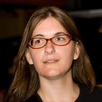
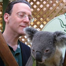
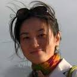
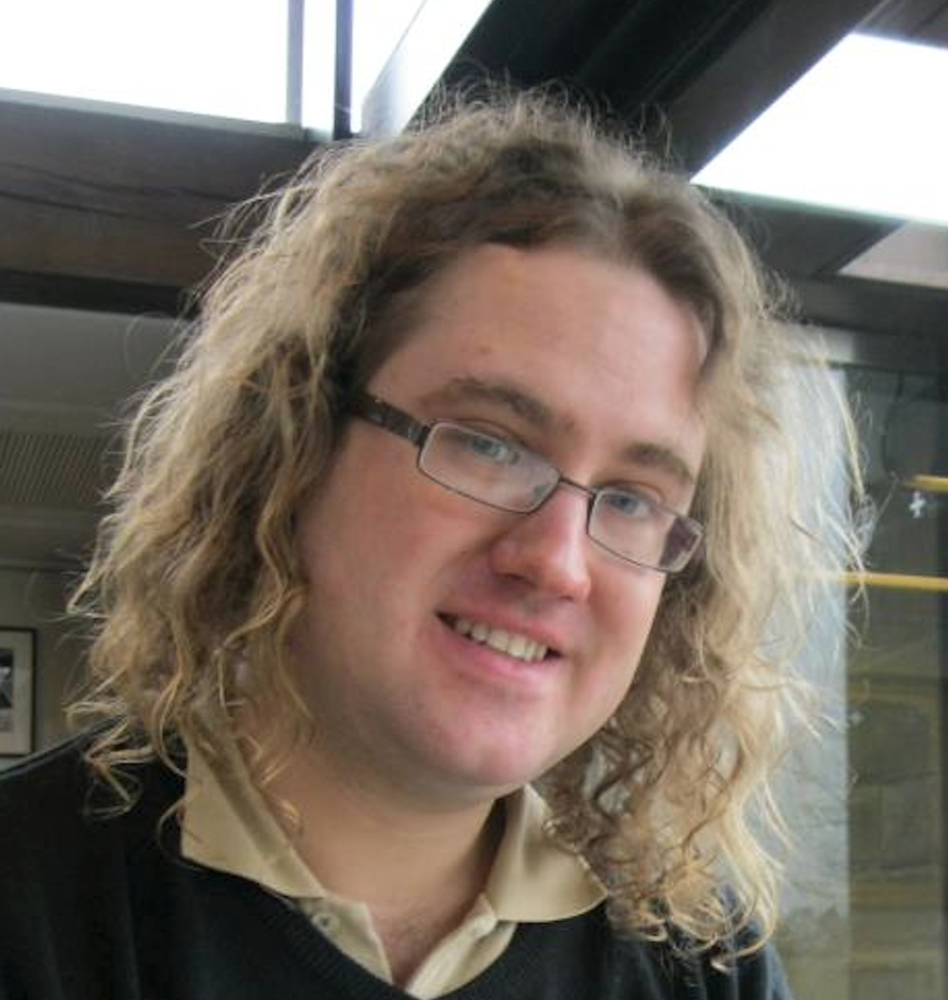
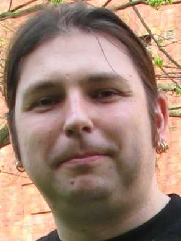
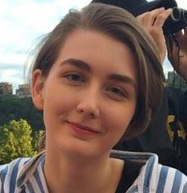
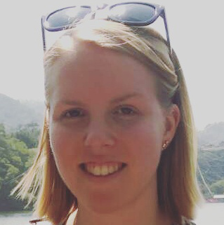
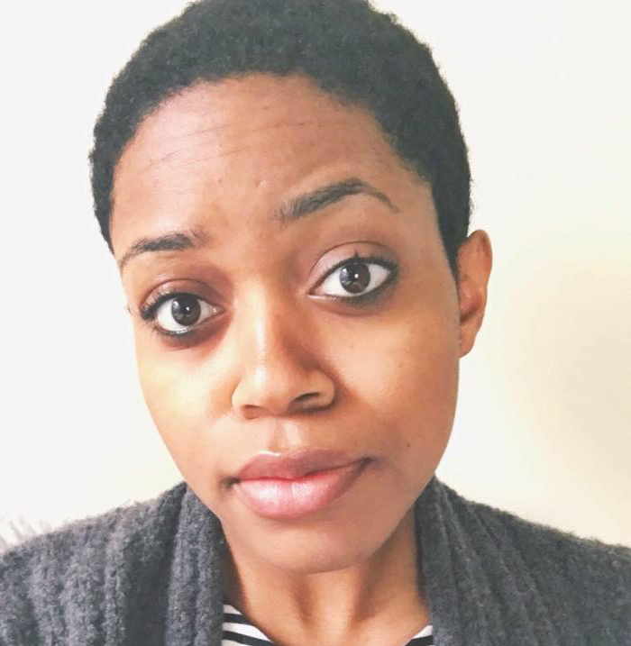
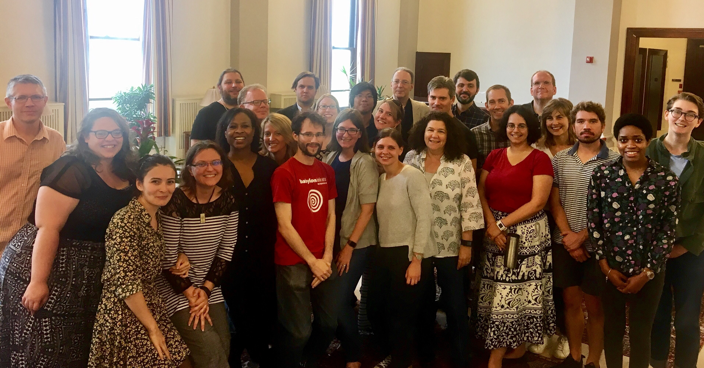

# Make _your_ edition: models and methods for digital textual scholarship

## Rationale

Digital humanists already have access to workshops and tutorials to help them learn to transcribe, edit, and tag a text in preparation for publishing a digital edition. Nonetheless, sophisticated markup expertise alone is not enough to make an edition, and learning nothing more than tagging may leave scholars staring at their angle brackets and wondering what to do next. Digital humanists cannot build editions that break new methodological ground solely on the basis of solutions prepared largely by others, and the focus of this Institute is on the creation of digital editions motivated by project-specific research questions and implemented from a perspective driven first by theory of edition, second by editorial methodology, and necessarily but less importantly by specific toolkits. In this respect, this Institute recognizes thinking digitally in ways driven by project-specific research goals as the most important feature of sustainable Digital Humanities training and education.
## Instructors

<table>
<tr><td></td><td style="vertical-align: middle">Tara Andrews Institute of History University of Vienna</td></tr>
<tr><td></td><td style="vertical-align: middle">David J. Birnbaum Department of Slavic Languages and Literatures University of Pittsburgh</td></tr>
<tr><td></td><td style="vertical-align: middle">Hugh Cayless Duke Collaboratory for Classics Computing (DC3) Duke University</td></tr>
<tr><td>&#xa0;</td><td style="vertical-align: middle">Ronald Haentjens Dekker Huygens Institute Royal Netherlands Academy of Arts and Sciences</td></tr>
<tr><td></td><td style="vertical-align: middle">Na-Rae Han Department of Linguistics University of Pittsburgh</td></tr>
<tr><td></td><td style="vertical-align: middle">Mike Kestemont Department of Literature University of Antwerp</td></tr>
<tr><td></td><td style="vertical-align: middle">Leif-Jöran Olsson Department of Swedish Language University of Gothenburg</td></tr>
</table>

The instructors will be assisted by:

<table>
<tr><td></td><td style="vertical-align: middle">Gabrielle (Gabi) Keane Senior Institute Assistant University of Pittsburgh</td></tr>
<tr><td></td><td style="vertical-align: middle">Eleanor (Kyri) Bennett Institute Assistant University of Pittsburgh</td></tr>
<tr><td></td><td style="vertical-align: middle">Kaylen Sanders Institute Assistant University of Pittsburgh</td></tr>
</table>

## Participants

Thank you to all of our participants for a brilliant Institute!
 
## Additional information

* [Call](admin/call.md) for applications
* [Lightning talk](admin/lightning.md) from the NEH Office of Digital Humanities Project Directors Meeting, 2016-09-16
* Follow us on Twitter: [@makeyouredition](https://twitter.com/makeyouredition), [#MakeYourEdition2017](https://twitter.com/hashtag/MakeYourEdition2017).
* [Digital editions created by Institute participants](general/participant_editions.md)

____
_Make_ your _edition: models and methods for digital textual scholarship_ has been made possible in part by a major grant from the National Endowment for the Humanities: Exploring the human endeavor. Any views, findings, conclusions, or recommendations expressed in materials developed for this project do not necessarily represent those of the National Endowment for the Humanities.

Additional support and assistance has been provided by the University of Pittsburgh Kenneth P. Dietrich School of Arts and Sciences, Computing Services and Systems Development (CSSD), the Faculty Research and Scholarship Program (FRSP), and the Joseph M. Katz School of Business EMBA Program. 

We are grateful to [SyncroSoft](http://www.sync.ro/) for generously contributing complimentary extended trial licenses for their [\<oXygen/\> XML editor](https://www.oxygenxml.com/) for the use of Institute participants.

 eXist-db is an open source native XML database and application platform. <a href="http://teipublisher.com/">TEI Publisher</a> is an open source product of <a href="http://www.existsolutions.com/">eXist Solutions</a>.
