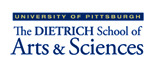

# Make _your_ edition: models and methods for digital textual scholarship

## Rationale

Digital humanists already have access to workshops and tutorials to help them learn to transcribe, edit, and tag a text in preparation for publishing a digital edition. These training resources play a vital role in empowering editors to formalize and instantiate their interpretations as markup, so as to make them available for subsequent analysis. Nonetheless, sophisticated markup expertise alone is not enough to make an edition, and learning nothing more than tagging may leave scholars staring at their angle brackets and wondering what to do next. For some a solution like TEI Tapas provides an adequate next step, but for those who wish to ask new types of questions of their documents, and to produce new types of editions that enable new types of research, an understanding of how to turn a set of tagged texts into a customized edition that meets individualized research goals is crucial. Digital humanists cannot build editions that break new methodological ground solely on the basis of solutions prepared largely by others, and the focus of this Institute is on the creation of digital editions motivated by project-specific research questions and implemented from a perspective driven first by theory of edition, second by editorial methodology, and necessarily but less importantly by specific toolkits. In this respect we foreground not learning a particular programming language or technology or framework, but learning to think and act digitally about the process of creating a digital edition. Because tools and technologies come and go, the Institute emphasizes learning to translate original digital thinking about editions into implementations of those editions, rather than on “tooling up” in the context of currently popular frameworks. In this respect, the Institute recognizes thinking digitally in ways driven by project-specific research goals as the most important feature of _sustainable Digital Humanities training and education._

## Instructors

* Tara Andrews (Institute of History, University of Vienna)
* David J. Birnbaum (Department of Slavic Languages and Literatures, University of Pittsburgh)
* Hugh Cayless (Duke Collaboratory for Classics Computing [DC3], Duke University)
* Ronald Haentjens Dekker (Huygens Institute, Royal Netherlands Academy of Arts and Sciences)
* Na-Rae Han (Department of Linguistics, University of Pittsburgh)
* Mike Kestemont (Department of Literature, University of Antwerp)
* Leif-Jöran Olsson (Department of Swedish Language, University of Gothenburg)

The instructors will be assisted by:

* Gabrielle (Gabi) Keane (Senior Undergraduate Institute Assistant, University of Pittsburgh)
* Kaylen Sanders (Junior Undergraduate Institute Assistant, University of Pittsburgh)

## Additional information

* [Call](admin/call.md) for applications
* [Lightning talk](admin/lightning.md) from the NEH Office of Digital Humanities Project Directors Meeting, 2016-09-16

____
_Make_ your _edition: models and methods for digital textual scholarship_ has been made possible in part by a major grant from the National Endowment for the Humanities: Exploring the human endeavor. Any views, findings, conclusions, or recommendations expressed in materials developed for this project do not necessarily represent those of the National Endowment for the Humanities.

Additional support and assistance was provided by the University of Pittsburgh Kenneth P. Dietrich School of Arts and Sciences, Computing Services and Systems Development (CSSD), the Faculty Research and Scholarship Program (FRSP), and the Joseph M. Katz School of Business EMBA Program. 

We are grateful to [SyncroSoft](http://www.sync.ro/) for generously contributing complementary extended trial licenses for their [\<oXygen/\> XML editor](https://www.oxygenxml.com/) for the use of Institute participants.