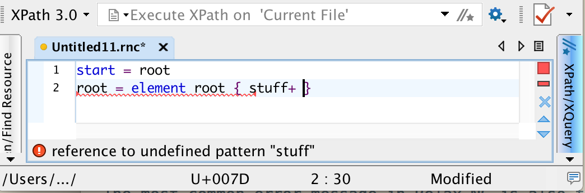
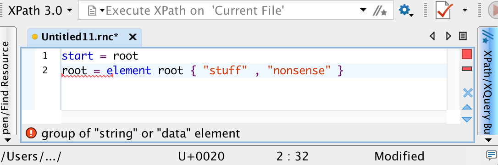
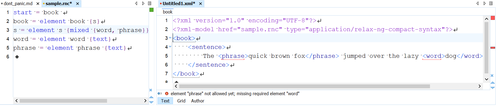

# Don’t panic: interpretation of error messages

Error messages are your friends. Alhough your immediate reaction to an error message may be one of anxiety, most of the time the message (e.g., text in a dialog box or the location of a red squiggly line in &lt;oXygen/&gt;) contains information you’ll need in order to correct a problem. Integrated development environments, web browsers, and command lines can all offer you important advice about how to correct problems in your code, but you need to take advantage of that advice! Below we explain some of the most common errors for different technologies and the best strategies for having success with their error messages.

New coders sometimes try to reduce the reporting of errors under the mistaken impression that they are reducing errors. That strategy is a mistake. The most damaging error is the one that you don’t know about, the one that gives you an incorrect response that you think you can trust. 

## Errors with XML technologies

If you're using oXygen XML Editor, chances are errors are going to be pretty clear and easily defined. Nonetheless, sometimes error messages show
up in odd places, which can confuse editors of every experience level. In XML, there are two ways to evaluate a document for errors: by well-formedness and by validity. Well-formed documents
follow the rules for every XML document, meaning there is one root element, there are no overlapping hierarchies, every open tag has a close tag, etc.
Validity is based on the schema(s) associated with the document. If there is no schema, you can assume all errors are well-formedness errors, and attempt to correct those with 
an eye for detail.
Many times, the solution for an elusive XML well-formedness error is to leave it alone and return with fresh eyes. Depending on what kind of schema you use, and how well it is written, validity errors are more easily resolved. Validity errors, as we explain below, can also indicate a problem with the schema model.

### Errors in Relax NG

### Reference to an undefined pattern

 The most common error message in Relax NG is also the easiest to fix: a reference to an undefined named pattern. The pattern name you have not defined appears in the error message itself, and a red squiggle appears under the line where you refer to the undefined pattern. Most often, this error message appears because you’ve referred a pattern you haven’t defined yet, and you can fix it by adding the definition. In other case, though, you may have mistyped the name of the pattern. 

### Group of “string” or “data” element


This error appears when you define an element or attribute with an invalid group of strings, rather than just a single string or datatype. 
Relax NG doesn’t permit patterns that juxtapose two string values. In most cases, you typed a comma (representing sequence) when you meant to type a pipe (representing choice).

### No error message, but something isn't right

When you develop a schema after the fact, to formalize the structure of an XML document, the schema itself may be valid, but an error message may appear when you validate the XML against the schema. In this development situation, though, we’ve stipulated that the XML says what it says, so if it isn’t valid against the schema that we’re crafting to model it, we need to fix the schema. 



In this case, the error message tells us we must have a `word` element before a `phrase` element, as we've used a comma to indicate we want one of each one, in that order.
***MORE EXPLANATION HERE***

To diagnose and fix this type of error, look specifically for phrases like “not allowed yet” and “not allowed here”. Does your schema require sequence where you mean choice? Or vice versa? Did you forget to mark something that repeats as repeatable? Error messages like these don’t point to the Relax NG because the Relax NG itself is valid, but readin the error message and scrutinizing the error context should help you identify where to lok in your Relax NG.

### Errors in XPath and XSLT

Each XSLT error message comes with its own unique identifier, which you can search online to find more information about the problem. This is especially useful when you start looking at StackOverflow, as more than likely someone else has been having your problem too, and someone else can’t wait to explain it to you.

### This xsl:element may not contain some other xsl:element

Just when you’ve decided to put an `<xsl:sort>` element in to sort your output, you get the error message `XTSE0010: An xsl:value-of element must not contain an xsl:sort element`. Your best bet, in this case, is to look up the documentation of the element you’re trying to use as the child element, as documentation is always more specific about what a parent element can or cannot be than it is about possible children.

## Reading stack traces in Python

### What are stack traces?

A **stack trace**, also called a **traceback**, is a type of error report produced by Python and other programming languages that shows the chain of events between the line of code that causes an error to arise and the part of the program where the error actually occurs. For example, if function A calls on function B and the user passes input into function A that function B cannot handle, a stack trace will report an error chain from function A (the most recent call, which led to the error) back to function B (the place where Python could not do what it was asked to do). Stack traces can be as deep as they need to be, and being able to read a stack trace is necessary for finding and fixing coding errors. 

### Getting an error report with an interactive command

We’re going to make some deliberate errors in order to produce a stack trace for illustrative purposes, and the first type of error we’ll provoke will be a “divide-by-zero” error. (Programming languages treat division by zero as undefined, and raise an error when you try to perform it.) To produce a divide-by-zero error at the command line, open a command-line session, type `python` to launch an interactive Python shell, and the type `6 / 0` at the Python command line. You should get an error report similar to the one below:

```python
Python 3.6.1 (v3.6.1:69c0db5, Mar 21 2017, 17:54:52) [MSC v.1900 32 bit (Intel)]
 on win32
Type "help", >>> 6/0
Traceback (most recent call last):
  File "<stdin>", line 1, in <module>
ZeroDivisionError: division by zero
```

The first two lines are feedback created when we open the Python shell (yours may look slightly different), and on the third line we’ve typed `6 / 0` at the Python shell prompt (`>>>`). The last three lines are the error report. (To exit a Python interactive shell when you’re finished with it, type either `quit()` or `Ctrl-d` at the Python prompt.)

This error report doesn’t show much information because there isn’t much to trace (we had just one brief line of code) and Python interactive shell doesn’t have a filename, so it reports only `<stdin>` (that is, input that you typed directly) as the location of the error.

To produce, for pedagogical purposes, a more interesting stack trace, let’s define and call some functions. 

#### Getting an error report with a user-defined function

Copy and paste the code below into a new `.py` document (you can create one in any plain text editor):

```python
def my_function():
	zero = 0
	anumber = divide(zero)
	return anumber
	
def divide(denominator):
	numerator = 6
	return numerator / denominator
	     
my_function()
```

Save the file; you can call it someting like `my_filename.py`. The last line runs `my_function()`. `my_function()`, in turn, defines a variable called `zero` with the numeric value of zero, and then passes that value into a call to the `divide()` function. Whatever the `divide()` function returns gets assigned to the variable `anumber`, which `my_function()` then returns. Meanwhile, the `divide()` function, in turn, receives the value passed into it, assigns it to the variable `denominator`, and divides the denominator into a numerator value of six. In this case, since the value passed into the `divide()` function is equal to zero, we are trying to divide 6 by 0, which raises an error because, as noted above, division by zero is treated as undefined.

To run this program, open a shell prompt, navigate to the directory holding the file, and type `python my_filename.py`. You should see something like the following error report:

```bash
cl2-wifi-10-215-50-16:tmp djb$ python div_by_zero.py
Traceback (most recent call last):
  File "div_by_zero.py", line 10, in <module>
    my_function()
  File "div_by_zero.py", line 3, in my_function
    anumber = divide(zero)
  File "div_by_zero.py", line 8, in divide
    return numerator / denominator
ZeroDivisionError: division by zero
```

The first line is our command prompt (through the dollar sign), followed by `python my_filename.py`, which we typed. The rest is the error report, and it’s most helpful to read a traceback, or stack trace, from the bottom up. It shows that there’s an error in line 8 of the file, in the `divide()` function, and that’s the line that performs the illegal division by 0. The stack trace tells you (on the second line of the sample, above) that the most recent call is last, which is to say that line 8 (which contains the actual division operation) got called by the stack item above it, line 3 of the same file , inside the `my_function()` function. That’s the line that called the `divide()` function in the first place, and therefore caused it to perform the illegal division. The error inside `my_function()`, in turn, is the result of the stack item above it, where `<module>` (the main routine in the `div_by_zero.py` file) called `my_function()` on line 10.

#### Type error

Many Python functions and operations accept only specific types of arguments. For example, the `abs()` function, which returns the absolute value of a number, accepts only numeric values. Thus, `abs(-2)` returns `2` but `abs('minus two')` returns a type error.

Try saving the following code to a file called `absolute.py` and then running it with `python absolute.py`:

```python
def absolute(input):
    return [abs(i) for i in input]
absolute([1,-2,3,'obdurodon'])
```

You should see something like the following stack trace:

```bash
cl2-wifi-10-215-50-16:tmp djb$ python absolute.py
Traceback (most recent call last):
  File "absolute.py", line 3, in <module>
    absolute([1,-2,3,'obdurodon'])
  File "absolute.py", line 2, in absolute
    return [abs(i) for i in input]
  File "absolute.py", line 2, in <listcomp>
    return [abs(i) for i in input]
TypeError: bad operand type for abs(): 'str'TypeError: bad operand type for abs(): 'str'
```

The first line is our command prompt (through the dollar sign), after which we’ve typed the command. The rest is the stack trace. Reading from the bottom up, the error is a TypeError, where we tried to apply the `abs()` function to a string ('str') value, which is prohibited. That error occurred inside a list comprehension (`<listcomp>`) in line 2 of our file. The list comprehension was part of a function called `absolute()`, and the error was in line 2 within the function. The `absolute()` function, in turn, was called from the main module of the file (`<module>`), on line 3 of our file.

If we look at the same stack trace from the top down, the line of code where we invoke the `absolute()` function doesn’t know what kinds of arguments `absolute()` can process without error. `absolute()`, in turn, calls on the Python library function `abs()`, but `absolute()` doesn’t know what types of values `abs()` can accept without error. For that reason, the error is only flagged when it reaches the `abs()` function. 

#### Stack traces and modules

Suppose we save our `absolute()` function in a separate module (file) and import it into another Python script. First create the following file and save it as `absolute.py`:

```python
def absolute(input):
    return [abs(i) for i in input]
```

Now create the following file and save it as `test.py`:

```python
from absolute import absolute
values = [1, -2, 3, 'obdurodon']
absolute(values)
```

`test.py` imports the `absolute()` function from `absolute.py`, creates a variable called `values` equal to a list of four values, and then applies the `absolute()` function to that list. It produces the following stack trace:

```bash
cl2-wifi-10-215-50-16:tmp djb$ python test.py
Traceback (most recent call last):
  File "test.py", line 3, in <module>
    absolute(values)
  File "/Users/djb/tmp/absolute.py", line 2, in absolute
    return [abs(i) for i in input]
  File "/Users/djb/tmp/absolute.py", line 2, in <listcomp>
    return [abs(i) for i in input]
TypeError: bad operand type for abs(): 'str'
```

Once again, the first line is our command prompt (through the dollar sign), followed by the command, which we typed. The errors appear in the same logical places as when all of the code was in one file. Reading from the bottom up, the `abs()` library function raises a type error when applied to a string, the string gets passed to `abs()` inside a list comprehension, the list comprehension occurs inside our `absolute()` function, and the `absolute()` function gets called on line 3 of our `test.py` file. Here, though we also get the name of the file that contains the `absolute()` function. The fact that a stack trace reports the filename, the line number, and the text of the offending line is a small convenience with code as simple as this example, but in a more complicated project, where modules (files) may call modules that may themselves call modules, the stack trace, as the name implies, allows us to trace the sequence of calls from the line in our code that provoked the error all the way back to the location where Python detected and reported it.

#### How to read a stack trace

There are three important moments in a stack trace: the top (the line of our code that provoked an error), the bottom (the place where the error was recognized and reported), and the moment where the errors make the transition from the code we wrote (we wrote the call to the `absolute()` function, and the call to `abs()` within the `absolute()` function) to code that is not under our control (the `abs()` function itself, which is part of the core Python library). 

In this case, that combination of information tells us that the error is happening because we are passing an illegal value from our invocation of the `absolute()` function into the body of that function, and then to the `abs()` function in the core Python library. It also tells us that if we want to trap and handle the error ourselves (for example, we could report illegal values to the user in a more graceful way than by dumping a stack trace, or we could silently ignore illegal values), we need to do it in code that we control. 