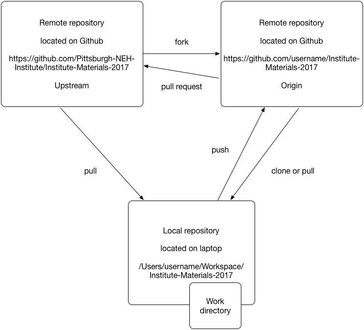

# Git tutorial part 2

## Forking repositories

* On Github fork the NEH Institute repository
* Clone you fork to your local machine
* On your local machine add the original repository as a second remote repository called upstream

## Making changes and submitting a pull request

* Create changes
* Track changes
* Commit changes
* Push commits
* Create pull request on github 

## How to work with branches

Command | Description
--------|------------
`git branch`   |   Create a new branch based on the last of commit of the current branch
`git checkout` |   Switch from one branch to another
`git checkout -b` | Create a new branch and switch to it
`git stash`    |   Temporarily move changed files out of the way
`git stash apply` | Reapply changes that were stashed previously

## How a merge works

Command | Description
--------|------------
`git merge <branch>` | Merge commits from one branch into the other.
`git merge --abort` | Abort a merge 

* Make sure you do not have uncommitted changes.
* If so, stash them or commit them
* Check that you are in the right branch with `$ git status`.
* If not do git checkout
* Do `git merge <branch>`

## How to resolve a merge conflict

## Notes

* Explain difference between a fork and a branch
* Explain git status (ahead / behind origin/master)
* Explain difference between a pull and a fetch
* 

## Forking repositories on Github

Note: has to do with permissions.

A fork is not a branch.

Syncing

`git remote show origin`

`git add remote ... upstream`

Set the origin to the original repository (on GitHub; so clone the original repository)

To change existing origin: 

This is wrong:

	git remote add origin
	Error: already exist

This is correct:

	git remote set-url origin
	git branch --set-upstream-to=origin/master master

`git remote add myfork https://github.com/etc`
`git push myfork master` etc.

## Terms learned part 2

* Branch
* Fork (GitHub term)
* Pull request (GitHub term)

## Notes

Fork is a remote repository on GitHub.
Branch is a thing in a repository
The Git `pull` command is not the same as a *pull request* on GitHub.
