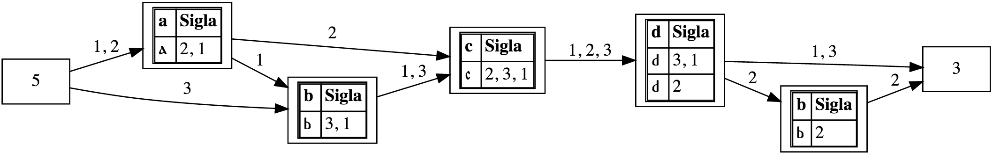

# Alignment

## Overview

As part of the collation of textual variants, alignment is the process of determining which tokens in one witness should be regarded as parallel to which tokens in another. Alignment thus presupposes [tokenization](tokenization.md). Furthermore, texts may be [normalized](normalization.md) before alignment as a way of treating as equivalent readings that are not string-equal. Normalization may be implemented in the text itself, completely leveling differences that may have been present originally, or it may be performed on shadow copies of the tokens, which lets the alignment process treat different readings as equivalent without irretrievably erasing evidence of the differences.

There are alignment ambiguities that are difficult even for a human to resolve unambiguously, such as aligning “Peter’s very blue cat” with “Peter’s very very blue cat”, where it is not clear which instance of “very” in the second witness is the appropriate alignment point for the single instance of “very” in the first. Where CollateX cannot make a principled decision, it makes an arbitrary one; in this case it would align “very” in the first witness arbitrarily with the first instance of “very” in the second.

To instantiate the alignment CollateX builds a *variant graph*, a structure that is represented by the following visualization:

The graph is *directed* from an empty *start* node (the square at the left numbered 5) to an empty *end* node (the square on the right numbered 3). The specific numbers in the start and end nodes are arbitrary, and are not important for understanding the graph. The graph also contains a lot of diagnostic information that is introduced by CollateX and that is useful for developers. The way to read the graph is as follows:

* There are three witnesses, which we number 1, 2, and 3. Their textual readings are as follows:
    * Witness 1: a b c d
    * Witness 2: a c d b
    * Witness 3: b c d
* The text of each witness is represented as a path through the graph. All paths start at the start node on the left and follow the numbered arrows until they reach the end node on the right. This means that you can, for example, trace the four tokens of Witness 1 by following the arrows numbered 1 from the start to the end. 
* The squares that represent nodes other than start and end all contain tables that consist of two-column rows. The top row presents a normalized reading in the left column and the heading label “Sigla” in the right. This header row is followed by one row for each different actual reading that is grouped within the normalization, and in those rows the left cell provides the literal text of the reading and the right cell lists the witnesses in which it appears. In this example, the leftmost node after the start node has a normalized reading of “a” (left cell in the top row), which appears in witnesses 1 and 2, and the actual (non-normalized) reading that appears in those witnesses is also “a” (the reading is in the left cell of the second row and the witness numbers in the right cell of the same row). The node that represents the token “d” looks odd because it has two rows in which the literal reading looks identical in the web rendering, but they’re actually different. Both are normalized to “d”, but in Witness 2 the “d” has a trailing white space because it’s followed by another token (recall that with the default tokenizer, the white space that separates tokens is kept with a preceding token in the textual reading, but ignored in the derived normalized version), while in Witnesses 1 and 3 it has no trailing space because it’s at the end of the witness text, and there was no space character there. If the visualization showed white space as a visible character, we would see that the reading for Witnesses 1 and 3 is one character long (just “d”), while the one for Witness 2 is two characters long (“d” plus the trailing space character). What the collation engine sees, though, is that they have the same normalized version (just “d”), so it groups them together in the variant graph.

CollateX can output the variant graph, and we sometimes do that for development purposes, but it is not a traditional way of representing variation to philologists. The variant graph is nonetheless used as an output format, intended for human interaction, in some modern applications, such as the [Stemmaweb](https://stemmaweb.net/stemmaweb/) collection of tools for analysis of collated texts. We discuss visualization under Stage 5 of the Gothenburg model, but we introduce the variant graph here because of the insights it provides into Stage 3, the alignment module.

So how does the alignment process build the variant graph? In the example to the right, from <https://wiki.tei-c.org/index.php/Textual_Variance>, imagine that each column represents a witness and each square with a letter in it (but not the ones with dashes) in the column represents a token:

> Looking at an example, assume that we have three witnesses: the first comprises the token sequence (a, b, c, d), the second reads (a, c, d, b), and the third (b, c, d). A collator might align these three witnesses as depicted in a tabular fashion on the right. Each witness occupies a column, matching tokens are aligned in a row, necessary gap tokens as inserted during the alignment process are denoted via a hyphen. Depending on the perspective from which one interprets this alignment table, one can say, for example, that the (b) in the second row was omitted in the second witness or it has been added in the first and the third. A similar statement can be made about (b) in the last row by just inverting the relationship of being added/omitted.

Witness 1 has four tokens (“a”, “b”, “c”, “d”), Witness 2 has the same four tokens, but in a different order (token “b” has been moved to the end), and Witness 3 has three tokens (“b”, “c”, “d”). At the alignment stage of the Gothenburg model, the alignment engine will recognize that all three witnesses have tokens “c” and “d” in order and connect them (represented by horizontal lines in the image here), which translates into grouping them into the same node in the variant graph above. It will also recognize that token “a” appears in only two witnesses, and it will align those and recognize that there is nothing in Witness 3 in the place where this token appears in the other two witnesses. The situation with token “b”, though, is complicated because it occurs in all three witnesses, but in different positions. At this stage the alignment process is not capable of changing the order of the tokens in the witnesses, so instead of recognizing the instance of “b” in Witness 2 as a counterpart of token “b” in the other two witnesses, it regards Witness 2 as having nothing corresponding to token “b” where it appears early in Witnesses 1 and 3, and then as having its own token “b” at the end that has no counterpart in the other two witnesses. For this reason, at this stage the alignment has not analyzed all of the variation that a human philologist would consider relevant to understanding the transmission of the text. In particular, this alignment (whether represented as the variant graph above or as the table to the right) treats the transposition of token “b” in Witness 2 as two mutually independent events, a deletion or omission and then an addition or insertion, while a human would regard those as part of a single transposition event.

## Computational complexity

The alignment of variants is a computationally complex problem. A naive approach to collation would be to generate all possible alignments of all tokens in all witnesses and evaluate them to identify the best one (according to some definition of “best”), but the computational complexity of this sort of brute-force approach is so great that it could not be completed for any but the very smallest (that is, unnaturally and unrealistically small) collation sets. For that reason, all computational alignment algorithms must find ways to reduce the number of operations to fewer than what would be required by this brute-force approach.

## Scalability and presegmentation

Alignment is a computationally complex task, and the complexity (that is, the amount of processing required) increases at a greater than linear rate according to the length of the text and the number of witnesses. For that reason, if you know that all of the variation in your text is within chapters, and that corresponding textual material is never in different chapters in different witnesses, you can increase the efficiency and the accuracy of the alignment process by presegmenting the witnesses into chapters and treating each chapter as an independent collation problem.

## Repetition

As we saw with our example of “Peter’s very blue cat” and “Peter’s very very blue cat”, the alignment engine may have no principled way to decide how to align a token in one witness when there is more than one corresponding token in another. This affects not only immediate repetition, as in this example, but also repetition at a distance. For example, in an English-language text in which the word “the” is frequent, an alignment engine needs to decide which instances of this word in one witness to align with which instances in another. If the witnesses are similar, that task may be easy, but if one witness has several more instances of “the” than the other, determining which have correspondences and which don’t becomes harder.

## Transposition

In the example above, the alignment engine failed to recognize that “b” had been transposed, and not independently deleted in one place and then inserted in another. Recognizing transposition is not too difficult in this minimal example, but in a long text where, say “the” is missing in one place in one witness but present in another, it can be difficult to determine whether it has been transposed, or whether there really are independent deletions and insertions. And where “the” is missing in several places but present in an additional one that we suspect represents transposition, it may be difficult to determine which instance of the missing “the” is the source of the transposition. We use the word “the” here because it’s so common, but repetition and transposition can affect any word, whether common or rare or in between.

## Order effects

Some alignment algorithms align multiple witnesses by first aligning two of them, then aligning a third against the output of aligning the first two, etc., adding one new witness each time. This is called *pairwise* or *progressive alignment*, and it breaks down a difficult problem (aligning multiple witnesses simultaneously) into a sequence of simpler ones (aligning just two things at a time). The cost of that simplification, though, is that we can get different output depending on the order in which we add witnesses to the alignment. These order effects are not informational: the optimal alignment of multiple witnesses should be independent of the order in which we happen to look at them. Some alignment algorithms seek to avoid order effects by aligning all witnesses at once, while others add one at a time but try to identify the optimal order for including them.

## Depth vs breadth

A set of several witnesses will typically have areas where they all agree, areas where many of them agree (with different dissenters), and areas with other patterns of agreement. We might heuristically approach collation by assuming that the longest common sequence of tokens where all witness agree is probably an optimal moment of alignment, and we can apply the same heuristic to successively shorter sequences with almost all witnesses in agreement, but at some point we’ll run out of strong agreement points and have to decide whether to favor longer sequences of tokens with fewer witnesses in agreement (breadth) or shorter sequences with more witnesses in agreement (depth). It is not always clear how to make optimal decisions as the remaining sequences grow shorter and shallower.

## Exact vs near (fuzzy) matching

Computers can identify exact matching quickly and efficiently, so we can tell that “The gray koala” and “The grey koala” match in their first and last word tokens and differ in their middle ones. What’s harder is to recognize that the middle tokens almost match, so if we have ten witnesses with ten different colors and we want to find the closest match, we need to calculate how close each one is, and that’s a more expensive operation than determining whether there is or is not an exact match. In this case we could tokenize on individual characters, rather than whitespace-delimited words, but in a real collation problem that would introduce other complications because the problems of repetition and transposition are much greater at the character level than the word level. By default CollateX recognizes only exact matching, but it has a near matching component that can be activated explicitly during the collation process. This component is engineered to minimize the complexity by staying out of the way most of the time, and operating only in situations where there are ambiguities in alignment that could potentially be resolved through near matching.

## Your turn!

If your edition includes textual variation, what alignment challenges does it pose?  
