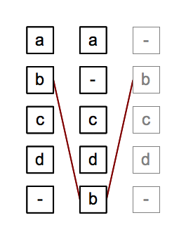

# Analysis

Analysis, stage 4 in GM, refers primarily to machine-assisted analysis, that is, to the machine-assisted evaluation and correction of the alignment. But because analysis is sandwiched between alignment (stage 3) and visualization (stage 5, which is the final stage), it also provides an opportunity for manual intervention.

## Automated analysis

Consider the following CollateX output of a collation of the 1818, 1823, and 1831 editions of Mary Shelley’s _Frankenstein_:

1818, 1823 | 1831
---- | ---- 
When my father became a husband and a parent, he found his time so occupied by the duties of his new situation, that he relinquished many of his public employments, and | There was a considerable difference between the ages of my parents, but this circumstance seemed to unite them only closer in bonds of
devoted | devoted 
himself to the education of his children. | affection.

The aligner has done the right thing in finding the corresponding tokens, but most editors would consider the alignment of “devoted” spurious; not only is it sandwiched between strongly differing readings, but it does not even represent the same part of speech. At the analysis stage a post-process might identify spurious matches and adjust the output of the alignment stage to correct for them. This could be automated by evaluating matching sections according to some function of their length, the length of the non-matching sections surrounding them, and perhaps also their frequency in the text (frequent tokens are more likely to be misaligned because of the Repetition issue discussed under [alignment](alignment.md)), and setting a threshold to distinguish true from spurious alignments.

## Manual analysis

Because alignment is probabilistic, in situations where there are multiple possible solutions, the aligner can choose the most likely one, but it cannot be confident of always choosing what a human will consider the correct one. Furthermore, not all misalignments can be identified and corrected automatically. For this reason, developers sometimes introduce a manual evaluation and correction process between alignment and visualization. This type of correction may be supported by specialized editing tools designed for the task, such as the graphical [Workspace for collaborative editing](http://dharchive.org/paper/DH2014/Paper-224.xml). Among other things, the Workspace makes it possible to fine-tune normalization interactively, specifying new regularizations and then recollating the texts. 

## Transposition

The following image represents the application of Gothenburg stage 4, Analysis, to the image described in our introduction to Gothenburg stage 3, [alignment](alignment.md). The image to the right and the description below are taken from <https://wiki.tei-c.org/index.php/Textual_Variance>:
 
> Echoing the example from the [above section](alignment.md), one might want to think of the token (b) in row 2 and 5 as being transposed instead of as being added/omitted separately. Some collators try to detect transpositions as part of the alignment process, some do it as a post-processing step and others do not handle transpositions at all and/or leave it to the user to declare those beforehand. Part of the reason for algorithmic differences in transpostion handling is the fact, that the question which tokens are actually transposed is much more a matter of interpretation than the question of matching and aligning them. While alignment results can still be judged in terms of their quality to some extent, transposition detection can only be done heuristically as one can easily think of cases, where it is impossible for a computer “to get it right”.

Note that we could alternatively have regarded tokens (b) as aligned and tokens (c) and (d) as transposed. Even where the presence of transposition (as opposed to mutually independent but coincidental deletion and insertion) can be determined with confidence, the direction of the transposition may not always be clear.

## Your turn?

A principal goal of machine-assisted collation is to obtain the optimal output from the aligner followed by automated analysis. The output of the aligner is typically the developer’s first opportunity to observe and evaluate the effects of any tokenization and normalization decisions, and to refine those decisions and rerun the aligner as needed. For that reason, it may not be possible to identify analysis opportunities in your own project until you’ve had a chance to see the output of the alignment stage.