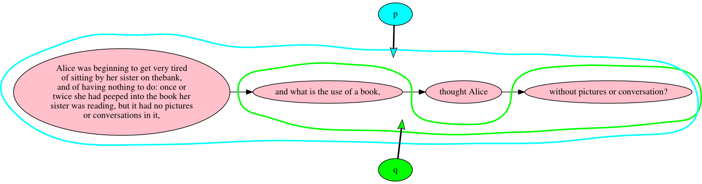

# Discontinuity

XML tag sets in common use distinguish quoted speech from narrative voice in a clear and natural way. Here is a small example of dialog interspersed with narrative from Matthew Lewis’s *The monk*:

> He paused, in expectation of an answer. As his speech did not
absolutely require one, the Lady did not open her lips: After a few
moments He resumed his discourse:
>
> “Am I wrong in supposing you to be a Stranger to Madrid?”
>
> The Lady hesitated; and at last, in so low a voice as to be scarcely
intelligible, She made shift to answer,—“No, Segnor.”
>
> “Do you intend making a stay of any length?”
> 
> “Yes, Segnor.”

We might represent this in XML along the lines of:

```xml
<p>He paused, in expectation of an answer.  As his speech did not
absolutely require one, the Lady did not open her lips:  After a few
moments He resumed his discourse:</p>
<p><q>Am I wrong in supposing you to be a Stranger to Madrid?</q></p>
<p>The Lady hesitated; and at last, in so low a voice as to be scarcely
intelligible, She made shift to answer,—<q>No, Segnor.</q></p>
<p><q>Do you intend making a stay of any length?</q></p>
<p><q>Yes, Segnor.</q></p>
```

Here we bracket the question of whether the full-paragraph speeches are paragraphs that contain quotations (`<q>` children of `<p>` parents) or speeches that consist of single paragraphs (`<p>` children of `<q>` parents) by deciding in favor of the former, since we have one instance of a paragraph that contains both narrated text and a `<q>` child. This is a question of hierarchy in XML terms (or of containment and dominance in more recent discussions), and a challenge to a strictly hierarchical model like XML, but the immediate continuation of the novel poses an even more difficult challenge:

> “I should esteem myself fortunate, were it in my power to contribute to
making your abode agreeable. I am well known at Madrid, and my Family
has some interest at Court. If I can be of any service, you cannot
honour or oblige me more than by permitting me to be of use to
you.”—“Surely,” said He to himself, “She cannot answer that by a
monosyllable; now She must say something to me.”
>  
> Lorenzo was deceived, for the Lady answered only by a bow.

The last sentence of the long paragraph contains a one-sentence thought (“Surely She cannot answer that by a monosyllable; now She must say something to me.”) interrupted by the narrator’s voice: “said He to himself” We might tag this as:

```xml
<p> … <q>Surely,</q> said He to himself, <q>She cannot answer that by a
monosyllable; now She must say something to me.</q></p>
```

The problem is that the markup uses two `<q>` elements to represent a single quoted sentence. The TEI provides several workarounds for this common phenomenon ([16.7 Aggregation](http://www.tei-c.org/release/doc/tei-p5-doc/en/html/SA.html#SAAG)), but the fact that discontinuous content objects must be represented differently from continuous ones in XML pushes information out of the model and into the application layer. Sperberg-McQueen and Huitfeldt illustrate this situation with the following sentence from Lewis Carroll’s *Alice in Wonderland*:

> Alice was beginning to get very tired of sitting by her sister on the bank, and of having nothing to do: once or twice she had peeped into the book her sister was reading, but it had no pictures or conversations in it, “and what is the use of a book,” thought Alice “without pictures or conversation?”

The challenge here is that the narrator’s “thought Alice” intrudes into the middle of a single, one-sentence thought that is otherwise conveyed in Alics’s voice. In their discussion of how discontinuity might be represented in various markup systems, the authors describe the familiar workaround of tagging the two quoted snippets separately:

```xml
<p>
Alice was beginning to get very tired of sitting by her sister on the bank,
and of having nothing to do: once or twice she had peeped into the book her 
sister was reading, but it had no pictures or conversations in it, <q>and what 
is the use of a book,</q> thought Alice <q>without pictures or conversation?</q>
</p>
```

They conclude that this strategy is problematic for at least the following reasons:

> It does not … capture the intuitive sense the reader may have that the reported thoughts of Alice form a single continuous unitary utterance, nor the interplay and alternation between the two voices. It would be desirable if the markup sufficed to allow some of the more obviously relevant inferences to be drawn, without losing any of the information provided in the original simple markup:  
> 
* This paragraph contains one (*one!*) quotation from Alice.  
* The sentence “What is the use of a book, without pictures or conversation?” occurs in the text (and should in principle be retrievable by a phrase search looking for *book* adjacent to *without*).  
* That one quotation from Alice is interrupted by the narrator's attribution of the thought to Alice.  
>
> […] *book* should for some purposes be treated as adjacent to *thought*, and for other purposes as adjacent to *without*.

Other examples of discontinuity involve stage directions in dramatic text, such as the following example from George Bernard Shaw’s *Mrs. Warren’s profession*:

> VIVIE. Sit down: I’m not ready to go back to work yet. [Praed sits]. You both think I have an attack of nerves. Not a bit of it. But there are two subjects I want dropped, if you don’t mind.
>
> One of them [to Frank] is love’s young dream in any shape or form: the other [to Praed] is the romance and beauty of life, especially Ostend and the gaiety of Brussels. You are welcome to any illusions you may have left on these subjects: I have none. If we three are to remain friends, I must be treated as a woman of business, permanently single [to Frank] and permanently unromantic [to Praed].

Here the last two stage directions interrupt not just the speech, but the sentence.

Discontinuity is more easily represented in TAG:



Here the Markup node with the `name` property value of “q” points to a set of Text nodes. TAG sets (unlike LMNL ranges) are not required to be continuous, which means that continuous and discontinuous quoted text is represented in the same way in TAG, by a hyperedge that points from a Markup node to a set of Text nodes.

## Sources

We adopt the example of discontinuity in *Alice in Wonderland* from C. M. Sperberg-McQueen and Claus Huitfeldt. “Markup discontinued: discontinuity in TexMecs, Goddag structures, and rabbit/duck grammars.” Presented at Balisage: The Markup Conference 2008, Montréal, Canada, August 12 - 15, 2008. In *Proceedings of Balisage: The Markup Conference 2008.* Balisage Series on Markup Technologies, vol. 1 (2008). DOI: 10.4242/BalisageVol1.Sperberg-McQueen01. <http://www.balisage.net/Proceedings/vol1/html/Sperberg-McQueen01/BalisageVol1-Sperberg-McQueen01.html>. We discuss both that example and the one from Shaw in Ronald Haentjens Dekker and David J. Birnbaum. “It’s more than just overlap: Text As Graph”. **[add link]**