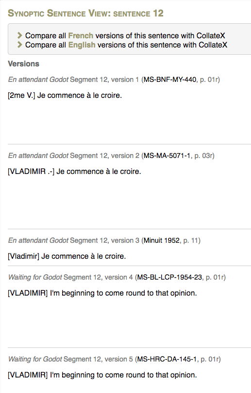
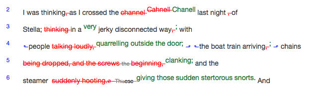

# Edition terms and concepts

## What is an edition?

In the afternoon session we discuss the following topics:

* Conceptualizing the edition as a *digital workstation*
* What we mean by *silicon paper*
* The role of the interface of a digital edition; interface as scholarship
* Reader-oriented theory of edition

First, we look into the different elements that constitute a scholarly edition.

## What goes into an edition?
The components of an edition can be considered from different perspectives. For example, we can look at a manuscript as an object in itself, or as a witness to a text. The definition of *text*, too, has been subject to debate. Take a look at the following, sometimes opposing concepts:

* Manuscript as object ~ witness to text
* Work ~ text ~ redaction
* Orthography ~ language
* Language (of the scribe ~ of the text)
* Documentary ~ analytical functions
* Research result ~ research resource
* Transcription principles

A scholarly edition represents an editorial argument about a text. A *digital* scholarly edition can contain more (background) information about that argument and can offer more ways to explore that argument. This prompts workflow questions: what do you leave in, what do you leave out? How do you interlink the edition's content to make it available to an end-user?

## The traditional shape of the edition

Scholarly editions come in a wide variety of flavours. This includes (but is not limited to) the following:

### Editions of manuscripts

* **Facsimile edition**: a photographic reproduction of the manuscripts, often with commentary
* **Diplomatic edition**: a transcription of a single manuscript with a focus on the physical qualities of the document, e.g. [IOSPE](http://iospe.kcl.ac.uk/5.5.html) or a [prototype](http://research.cch.kcl.ac.uk/proust_prototype/) of an opening of Marcel Proust's notebook.
* **Genetic edition**: an edition of the *genetic dossier* which consists of all material traces of the genesis and development of a literary work, such as draft notebooks and revised typescripts.
An examplary genetic edition is the [Beckett Digital Manuscript Project](http://www.beckettarchive.org/). See also the [Shelley-Godwin Archive](http://shelleygodwinarchive.org/sc/oxford/frankenstein/volume/i/#/p2).

### Critical editions of texts
In a critical edition the editor attempts to establish what is commonly referred to as the “best text” or “ur text”: the editor choses a copy text (usually the most authorative manuscript) and amends it based on other manuscript witnesses. Alternatively, editors would compare versions of manuscripts and create an “ideal text” that did not exist in any individual copy. 

### Copy text with notes (apparatus)
A traditional way to represent textual variance in a scholarly edition is to centralize a copy text and store the variant readings in footnotes or end notes to the text. These notes form the apparatus. See for example [St. Patrick’s *Confessio*](http://www.confessio.ie/etexts/confessio_latin#02), a critical edition that presents three different forms of an apparatus.

### Interlinear collation or vertical apparatus

An alternative presentation of textual variance is interlinear collation (also referred to as “synoptic collation” or “vertical apparatus”) in which the textual variants are represented vertically line by line. 

Interlinear collation is similar to the integral apparatus (see below): a text presentation that incorporates variance into the invariant context. It represents the text itself as a dynamic, multilayered construct. Visualizations of interlinear collation can vary; editors may or may not select a copy text against which the alternative witnesses are contrasted. 

Compare the synoptic representation used by the Beckett Digital Manuscript Project, with the [Rus′ primary chronicle](http://pvl.obdurodon.org/browser.xhtml).

| |
| :--:|
| *Excerpt of the synoptic sentence view of sentence 12 of “Waiting for Godot” in the [Beckett Digital Manuscript Project](http://www.beckettarchive.org/)*

### Digital Repertory
A digital repertory employs the potential of a digital edition to include a great amount of information about a text: the digital repository [Catullus Online](http://www.catullusonline.org/CatullusOnline/index.php?dir=poems&w_apparatus=1&showall=1), for example, presents not only an apparatus with information about the textual variance but also a repertory of scholarly conjectures about the poems of Catullus.

### “Best witness” ~ dynamic critical text:

The debate about what would be the best method to examine and represent textual variation goes back to ancient Greece. The librarians of the Library of Alexandria set out to collect multiple copies of manuscripts of the same work. Alexandrian librarians were primarily interested in copies that were different, and they used collation to list the variant readings. Based on the study of these copies, the librarians than tried to establish an “*ideal text*” that was not present in any individual copy. Conversely, textual scholars in the ancient city of Pergamum used collation and textual analysis to select a “*best text*” out of existing manuscript copies, arguing that at least an existing copy represents an actual historical moment in the transmission of the text.

This dichotomy continues to exist in the centuries that followed. On the one side, we have the Alexandrian scholars, who compared copies of a text to arrive to a Platonic, ideal text. On the other side, their colleagues in Pergamum collated texts to determine the best existing copy. A similar distinction can be found with present day Anglo-American edition theory, which differentiates between constructing the ideal text and examining copies to find the best text. For instance, the copy-text editing theory of W.W. Greg is grounded on principles that are very similar to those of the Pergamum scholars. 

The remarks of Alfred Housman provide an interesting perspective on this matter: 
> An editor of no judgment, perpetually confronted with a couple of MSS. to choose from, cannot but feel in every fibre of his being that he is a donkey between two bundles of hay. What shall I do now? Leave criticism to the critics, you might say, and betake himself to any honest trade for which he is less unfit. But he prefers a more flattering solution: he confusedly imagines that if one bundle of hay is removed he will cease to be a donkey. (A. E. Housman, *Selected prose.* Cambridge: Cambridge University Press, 1961.)

An oft-praised quality of the digital medium is that it doesn't impose a choice between two <del>bundles of hay</del> texts. If we can easily include _every_ textual witness and represent them in a dynamic way, why should we bother to select one best witness? 

In a way, then, digital editions relieve editors from the burden of having to make a judgment on the best text. Yet this does not imply that digital editing is not a scholarly endeavour. It is generally acknowledged that scholarly editing is a process of critical decision-making and this is no different for digital editing. From data modeling to transcribing and  developing an interface: the choices we make influence the look, feel and (future) use of our edition. 

### Apparatus types

One key aspect of the decision-making process is the selection and presentation of a text's witnesses. Every apparatus is a collection of variant readings. In the words of Michael Sperberg-McQueen: 
> the apparatus serves as a constant reminder that the text is a historical artifact, the variants as an invitation to consider alternatives to the reading text and to check the editor’s work in establishing that text.  

There exist a variety of apparatus types:

* _Apparatus fontium et locorum parallelorum_ “contains references to those texts that served as source for the edited text—this includes also the Bible—and to texts that cannot have been used as a source, but which show a close parallel to the edited text.” (_CCSG_ 8)
* _Traditio textus_: “sigla of the manuscripts on which the edition is based are repeated on each page of the edition.” (_CCSG_ 10)
* _Apparatus criticus_
 	* Positive ~ negative  
	A positive apparatus shows evidence both for and against the text. The negative apparatus assumes that “unless variant readings are given, the manuscripts contain the text as printed”: it shows only evidence *against* the text. 
	* Complete ~ significant variants (~ orthographic variants)
* _Comparative apparatus_: “If a text survives in different recensions, one of the recensions produces the edited text and it can be decided to give the differences with the other recensions in a _Fassungsapparat_. A similar apparatus can also be included in the case of florilegia, to compare the excerpts with their respective source text.” (_CCSG_ 11)
* _Indirect tradition_: “If a substantial and important indirect tradition of the edited text exists, it may be decided to include the differences between the indirect tradition and the edited text in a separate apparatus.” (_CCSG_ 11)
* _Integral apparatus_: a mode of text presentation incorporating variance into the invariant context. See the Synoptic Edition of Virginia Woolf's _A Sketch of the Past_: 

|  |
|:--:|
| *Excerpt of the synoptic edition of Woolf's “A Sketch of the Past”, a prototype created by Joshua Schaüble and Hans Walter Gabler.* |

### A critical look at the critical apparatus

* **Advantages: compactness, familiarity**  
A (negative) apparatus displays textual variance in a condensed way. It is a traditional way of representing variation that many textual scholars are familiar with. 
* **Disadvantages: compromised legibility, incompleteness**.  
It takes time to get familiar with the often complex system of diacritical signs used in a critical apparatus. Furthermore, an apparatus could be considered as not doing justice to the dynamic nature of text, because it foregrounds just one witness. For that reason, the critical apparatus has been described as a cemetery: textual variants are demoted to appendices or footnotes where they get very few visitors (see Vanhoutte 1999).

## Reconsidering the role of the apparatus

* The apparatus contains information about variation, sources, etc., selected, ordered, and otherwise mediated by the editor.
* The apparatus *format* is a traditional approach to presenting that information. Other formats are possible.

_____

## Readings (optional)

* Andrews, Tara. 2012. [“The third way: philology and critical edition in the digital age”](https://www.academia.edu/2510270/The_Third_Way_Philology_and_Critical_Edition_in_the_Digital_Age) _Variants_ 10.
* Vanhoutte, Edward. 1999. “Where is the editor? Resistance in the creation of an electronic critical edition”. _Human IT: Journal for Information Technology Studies as a Human Science_, 3:1.
* [_CCSG_] Brepols publishers. [“Instructions and stylebook for the publication of texts in CCSG [_Corpus christianorum series graeca_].”](http://www.corpuschristianorum.org/series/pdf/CCSG_Guidelines.pdf)
* Sels, Lara and David J. Birnbaum 2015. [“Editing the _Bdinski sbornik_ as a multilayered reality.”](../../general/2014-01-14_bdinski-sofia-paper.pdf) _Агиославика. Проблеми и подходи в изследването на Станиславовия чети-миней: доклади от едноименната конференция - 21 май 2013 г._ (_Hagioslavica. Issues and approaches in the study of the_ Stanislav Reading Menaion: _presentations from the conference of May 21, 2013._), ed. Diana Atanasova. Sofia: Kliment Oxridski University, pp. 184–99.
* Schäuble, Joshua and Hans Walter Gabler. 2016. “Visualising processes of text composition and revision across document borders”. Paper presented at the International Symposium “Digital Scholarly Editions as Interfaces” at the Centre for Information Modelling – Austrian Centre for Digital Humanities. September 23-24, 2016. 
* Sperberg-McQueen, C. Michael. 2009. “How to teach your edition how to swim.” Literary and linguistic computing 24.1: 27-39.
