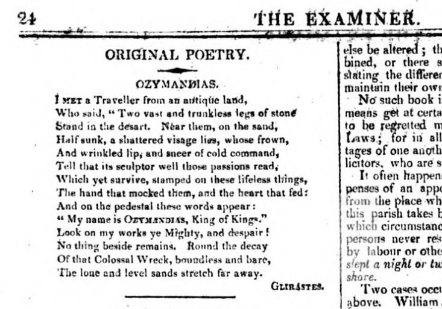
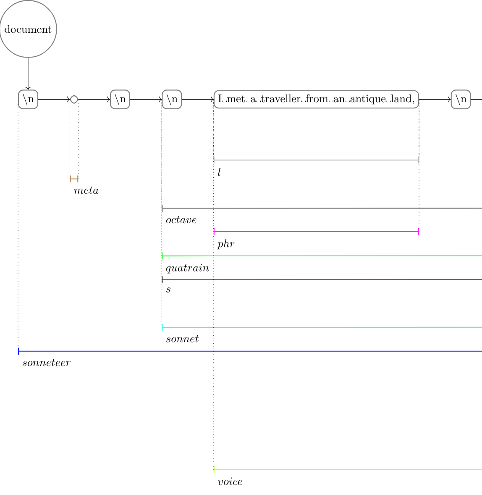
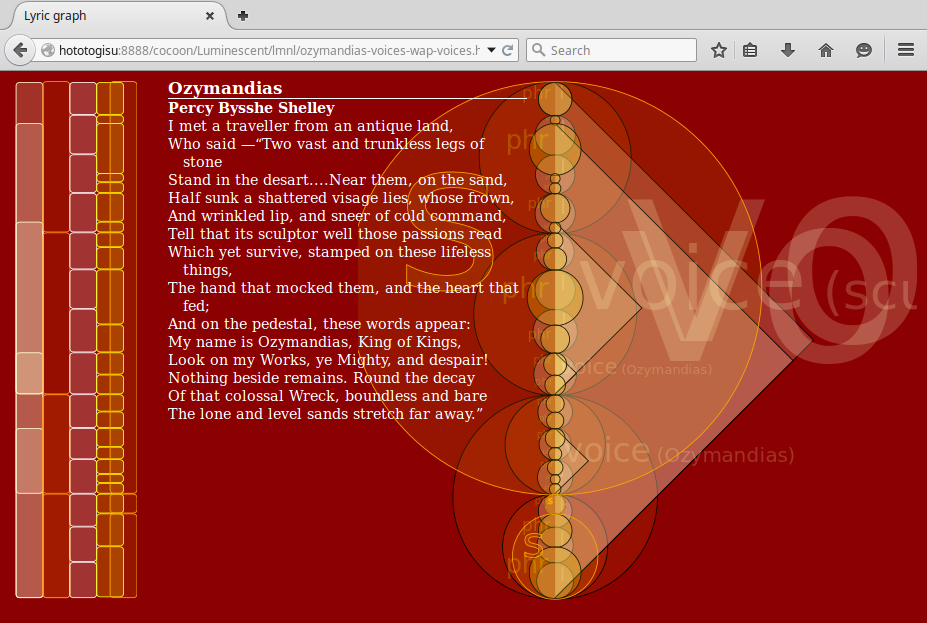

# Visualization of LMNL in Alexandria

This page illustrates the visualization of overlap in “Ozymandias”.

## Source

Percy Bysshe Shelley’s “Ozymandias” was first published in _The examiner_ in 1818:



Image from <https://en.wikipedia.org/wiki/Ozymandias#/media/File:Ozymandias_The_Examiner_1818.jpg>

## LMNL markup

We can mark up “Ozymandias” in LMNL along the following lines:

```text
[sonneteer [id}ozymandias{id]}
[meta [author}Percy Bysshe Shelley{author] [title}Ozymandias{title]]
[sonnet}[s}[octave}[quatrain}
[l}[voice [who}Narrator{]}[phr}I met a traveller from an antique land,{phr]{l]
[l}[phr}Who said —{phr][voice [who}traveller{][discourse}direct{]}[phr}“Two vast and trunkless legs of stone{l]
[l}Stand in the desart.[caesura}...{caesura]{phr][phr}Near them,{phr] [phr}on the sand,{phr]{l]
[l}[phr}Half sunk a shattered visage lies,{phr] [voice [who}sculptor{][discourse}implicit{]}[phr}whose frown,{phr]{l]{quatrain]
[quatrain}[l}[phr}And wrinkled lip,{phr] [phr}and sneer of cold command,{phr]{l]
[phr}[l}Tell that its sculptor well those passions read{l]
[l}Which yet survive,{phr] [phr}stamped on these lifeless things,{phr]{l]
[l}[voice [who}Ozymandias{][discourse}implicit{]}[phr}The hand that mocked them,{phr] [phr}and the heart that fed;{phr]{voice]{voice]{l]{quatrain]{octave]
[sestet}[tercet}[l}[phr}And on the pedestal,{phr] [phr}these words appear:{phr]{l]
[l}[voice [who}Ozymandias{][discourse}direct{]}[phr}My name is Ozymandias,{phr] [phr}King of Kings,{phr]{l]
[l}[phr}Look on my Works,{phr] [phr}ye Mighty,{phr] [phr}and despair!{phr]{l]{voice]{tercet]{s]
[tercet}[l}[s}[phr}Nothing beside remains.{phr]{s] [s}[phr}Round the decay{l]
[l}Of that colossal Wreck,{phr] [phr}boundless and bare{l]
[l}The lone and level sands stretch far away.{phr]”{l]{s]{tercet]{sestet]{voice]{voice]{sonnet]
{sonneteer [encoding [resp}ebeshero{][resp}wap{]]]
```

Example from <https://github.com/wendellpiez/Luminescent>

## Visualizations

### Alexandria

[Alexandria](../week_3/alexandria.md) ingests the LMNL markup and interprets it as TAG. The structure can be visualized in Alexandria. Below is an excerpt; click on it to open a visualization of the full hypergraph:

[](images/ozymandias_hypergraph.svg)

### Sonneteer

As part of the [Sonneteer](http://pellucidliterature.org/Sonneteer/index.html), a set of experiments in the LMNL visualization of overlap in poetry, [Wendell Piez](http://www.wendellpiez.com/) used [Luminscent](https://github.com/wendellpiez/Luminescent), a LMNL transformation tool written in XSLT, to create the following graphic visualization of “Ozymandias”:

  