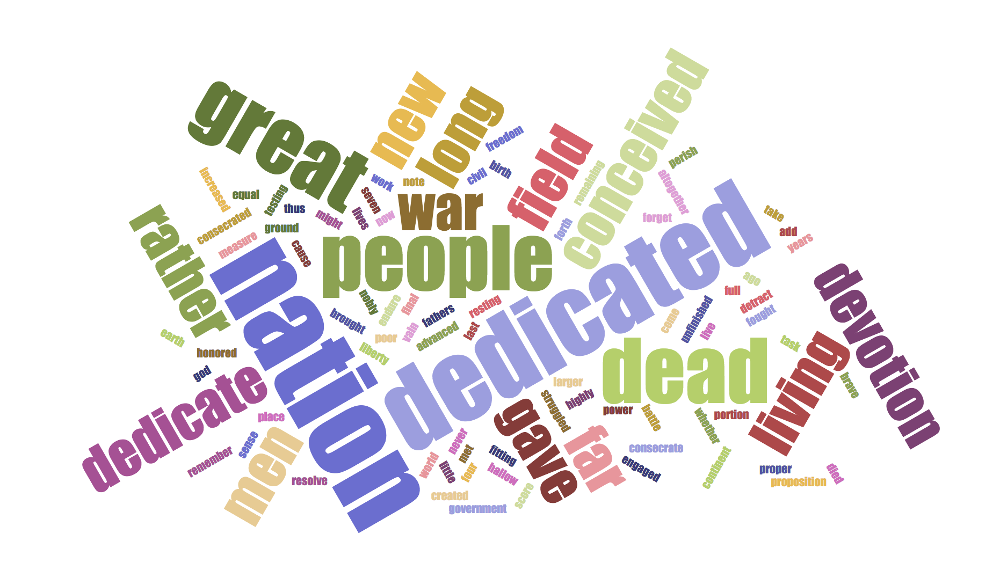

# Data model, syntax, and markup semantics

## Data model

A data model is an abstract understanding of structure, independently of its representation. For example, a list is a data model that may be represented in different ways. As bullet points:

```
• Curly
• Larry
• Moe
```

or as a comma-delimited string:

```
Curly, Larry, Moe
```

or in other ways, but it is still a list of three stooges.

## Syntax

We use the terms *syntax* and *serialization* to refer to textual *expressions* of a model. Information structured according to a model may be *serialized* as textual characters that are governed by syntactic rules. For example (and we’ll return to this later today), the XML data model is a tree, but the textual serialization of XML is a string of characters that include angle brackets, with syntactic rules that govern the use of the angle brackets in a way that enables them to express the tree structure. Information being modeled may also be expressed graphically; a fragment of an XML transcription may be represented as a tree. Technically this graphical representation is not a serialization because the term *serialization* means ‘as a sequence (i.e., *series*) of characters’, but it is nonetheless an expression of an abstract model.

By means of illustration, let's take a look at the different ways to serialize a data model. The sections below take as example a list and and RDF graph. 

### Alternative representations of a list

As was noted above, a list (in the case below, of the most frequent words in a document) is a model that may be serialized or otherwise represented in different ways. An ordered rendering (in the stooge example above, vertical and bulleted or horizontal and comma-separated) is one approach to serialization. In the example below we contrast a textual serialization and a graphic representation of the same abstract word frequency list. 

Here is the text of Abraham Lincoln’s _Gettysburg Address_ (we removed punctuation and converted everything to lower case before generating frequency lists and word clouds):

> Four score and seven years ago our fathers brought forth on this continent, a new nation, conceived in Liberty, and dedicated to the proposition that all men are created equal.  
Now we are engaged in a great civil war, testing whether that nation, or any nation so conceived and so dedicated, can long endure. We are met on a great battle-field of that war. We have come to dedicate a portion of that field, as a final resting place for those who here gave their lives that that nation might live. It is altogether fitting and proper that we should do this.  
But, in a larger sense, we can not dedicate -- we can not consecrate -- we can not hallow -- this ground. The brave men, living and dead, who struggled here, have consecrated it, far above our poor power to add or detract. The world will little note, nor long remember what we say here, but it can never forget what they did here. It is for us the living, rather, to be dedicated here to the unfinished work which they who fought here have thus far so nobly advanced. It is rather for us to be here dedicated to the great task remaining before us -- that from these honored dead we take increased devotion to that cause for which they gave the last full measure of devotion -- that we here highly resolve that these dead shall not have died in vain -- that this nation, under God, shall have a new birth of freedom -- and that government of the people, by the people, for the people, shall not perish from the earth.

Here is a list of the 25 most frequent words, with their frequencies:

Word | Frequency
---- | ----
nation | 5
dedicated | 4
people | 3
dead | 3
great | 3
far | 2
living | 2
conceived | 2
men | 2
devotion | 2
new | 2
field | 2
rather | 2
gave | 2
war | 2
long | 2
dedicate | 2
testing | 1
birth | 1
forth | 1
civil | 1
come | 1
larger | 1
take | 1
struggled | 1

Here is word cloud of the text:



The data model we employ to model the most frequent words is an ordered list, which is expressed above as a table (a serialization) and, graphically, as a word cloud. Both of these expressions represent properties of the individual words (text, frequency) and relationships among them (relative frequency). How does each do that? Only the word cloud has color; what does it represent, and is there anything analogous to color in the table? Both the table and the word cloud have to position the words with respect to one another; how does each representation use position to express information? How are ties represented in the two expressions? Does either expression impose artifactual features that are not part of the abstract model? What are the advantages and disadvantages of the two as representations of the abstract model of a frequency list? 

#### Bibliographical information

Text of the Bliss copy of Abraham Lincoln’s _Gettysburg Address_ is from <http://www.abrahamlincolnonline.org/lincoln/speeches/gettysburg.htm>. The frequency list was generated at <http://www.wordcounter.com/>, with stop words removed. The Word Cloud was generated at <https://www.jasondavies.com/wordcloud/> using default values.

### Alternative representations of RDF

_Resource Description Framework_ (RDF) is a _framework for describing resources on the web_. It is a part of the W3C's _Semantic Web_ Activity. RDF is designed to be read and understood by computers, not displayed to people. 

Still, it is worthwhile to be able to read RDF. For that reason RDF is written in XML for easy _exchange_ between systems so it can still be read by people. It also has other serializations. 

Let's return to the text of the _Gettysburg Address_. RDF uses Web identifiers (_URIs_) to _identify_ resources. It describes them with _properties_ and _property values_. It this case we are using the derived _properties_ (word/lemma frequencies) of the Gettysburg Address (_the resource_). 

RDF can be serialized in different ways. The following two examples are showing one serialization in XML and the second in JSON-LD (JSON linked data). In both serializations we see specific keywords which are not in the other serialization: 

```xml
<?xml version="1.0" encoding="utf-8"?>
<rdf:RDF 
 xmlns:rdf="http://www.w3.org/1999/02/22-rdf-syntax-ns#"
 xmlns:c="https://www.example.com/rdf/corpus"
 xml:lang="en">
  ...
  <rdf:Description rdf:about="https://www.example.com/rdf/corpus/gettysburg/lemma/nation">
    <c:lemma>nation</c:lemma>
    <c:frequency>5</c:frequency>
    <c:instances>
      <rdf:Seq>
	<rdf:li>https://www.example.com/rdf/corpus/gettysburg#n017</rdf:li>
	<rdf:li>https://www.example.com/rdf/corpus/gettysburg#n048</rdf:li>
	<rdf:li>https://www.example.com/rdf/corpus/gettysburg#n052</rdf:li>
	<rdf:li>https://www.example.com/rdf/corpus/gettysburg#n100</rdf:li>
	<rdf:li>https://www.example.com/rdf/corpus/gettysburg#n289</rdf:li>
      </rdf:Seq>
    </c:instances>
  </rdf:Description>
  <rdf:Description rdf:about="https://www.example.com/rdf/corpus/gettysburg/lemma/dedicated">
    <c:lemma>dedicated</c:lemma>
    <c:frequency>4</c:frequency>
    <c:instances>
      <rdf:Seq>
	<rdf:li>https://www.example.com/rdf/corpus/gettysburg#n024</rdf:li>
	<rdf:li>https://www.example.com/rdf/corpus/gettysburg#n057</rdf:li>
	<rdf:li>https://www.example.com/rdf/corpus/gettysburg#n208</rdf:li>
	<rdf:li>https://www.example.com/rdf/corpus/gettysburg#n234</rdf:li>
      </rdf:Seq>
    </c:instances>
  </rdf:Description>
  <rdf:Description rdf:about="https://www.example.com/rdf/corpus/gettysburg/lemma/people">
    <c:lemma>people</c:lemma>
    <c:frequency>3</c:frequency>
    <c:instances>
      <rdf:Seq>
	<rdf:li>https://www.example.com/rdf/corpus/gettysburg#n309</rdf:li>
	<rdf:li>https://www.example.com/rdf/corpus/gettysburg#n313</rdf:li>
	<rdf:li>https://www.example.com/rdf/corpus/gettysburg#n317</rdf:li>
      </rdf:Seq>
    </c:instances>
  </rdf:Description>
  ...
</rdf:RDF>
```

The RDF/XML example above consists of a number of statements.  An RDF statement is formed by a resource, a property, and a property value (known as a subject, a predicate, and an object respectively). Let's take a closer look at the following RDF statement:

```xml
<rdf:Description rdf:about="https://www.example.com/rdf/corpus/gettysburg/lemma/nation">  
<c:lemma>nation</c:lemma>
```

- The subject is "https://www.example.com/rdf/corpus/gettysburg/lemma/nation"
- The predicate is ```lemma```
- The object is ```nation```

The same information in RDF can also be serialized as JSON-LD:

```json
{
  "@context": {
    "@id": "https://www.example.com/rdf/corpus",
    "type": "@id",
    "label": "http://www.w3.org/2000/01/rdf-schema#label",
    "@language": "en"
    },
  "@id": "https://www.example.com/rdf/corpus/gettysburg/lemma#nation",
  "@type": "frequencies",
  "lemma": "nation",
  "frequency": 5,
  "instances": { "@list": 
     ["https://www.example.com/rdf/corpus/gettysburg#n017",
      "https://www.example.com/rdf/corpus/gettysburg#n048",
      "https://www.example.com/rdf/corpus/gettysburg#n052",
      "https://www.example.com/rdf/corpus/gettysburg#n100",
      "https://www.example.com/rdf/corpus/gettysburg#n289"]
     },

  "@id": "https://www.example.com/rdf/corpus/gettysburg/lemma#dedicated",
  "@type": "frequencies",
  "lemma": "dedicated",
  "frequency": 4,
  "instances": { "@list":
     ["https://www.example.com/rdf/corpus/gettysburg#n024",
      "https://www.example.com/rdf/corpus/gettysburg#n057",
      "https://www.example.com/rdf/corpus/gettysburg#n208",
      "https://www.example.com/rdf/corpus/gettysburg#n234"]
     },

  "@id": "https://www.example.com/rdf/corpus/gettysburg/lemma#people",
  "@type": "frequencies",
  "lemma": "people",
  "frequency": 3,
  "instances": { "@list": 
     ["https://www.example.com/rdf/corpus/gettysburg#n309",
      "https://www.example.com/rdf/corpus/gettysburg#n313",
      "https://www.example.com/rdf/corpus/gettysburg#n317"]
     }
...
}
```

We can model text in many different ways: as plain text, as list, as XML, as RDF, etc. Because a transformation from one to another may also include some data loss, it is important to be aware of the model's strengths and weaknesses. This also helps you to better accommodate the mismatch between the model and the object that you are modelling.

## Markup semantics

We’ll use XML as our principal example of the relationships among model, syntax, and semantics because it is familiar to most digital editors. Still, these relationships are applicable in other situations, as well (and we briefly introduce an example from TexMECS markup below, for comparison).

### Schema rules apply semantics to control markup

As far as the XML data model is concerned, element and attribute names are arbitrary, which is to say that they have no semantics. The names may be chosen for mnemonic convenience, but an XML processor doesn’t know or care what the names mean as words. Schema validation allows the user to impose constraints beyond well-formedness that are motivated by markup semantics. For example, we can use schema validation to permit footnotes inside paragraphs in main text but not inside paragraphs that are, themselves, inside footnotes. But an XML processor still doesn’t know what a paragraph or a footnote is.

### Some markup properties are artifactual 

##### Order between XML sibling elements

The children of an XML element are always ordered in the XML data model, which is what we normally want, since, for example, if we change the order of paragraphs in a chapter, the meaning of the text in the document changes as well. But some items may not be inherently ordered, such as an abbreviation and its expansion or an error and its correction. The TEI uses a `<choice>` element to represent that the order between an `<orig>` and a `<reg>` is arbitrary. However, an XML parser cannot know that the order of the children of a `<choice>` element is different from the order of the paragraphs in a chapter. The same applies to software implementations that read the XML file. In other words, they do not see the difference between XML elements that are inherently ordered, like the `<p>`s in this `<div>` :

```xml
<div type="chapter">
	<p n="1">
		<!-- some text here -->
	</p>
	<p n="2">
		<!-- some text here -->
	</p>
</div
```

and XML elements that are not ordered, like the `<sic>` and the `<corr>` in the `<choice>` below:

```xml
<s>What a 
  <choice>
	<sic>mitsake</sic>
	<corr>mistake</corr>
  </choice>to make!
</s>

```

Again, you can express in the schema whether the order of sibling elements is informational or not, e.g., that the order of the siblings `<p n="1">` and `<p n="2">` in the example above _is_ informational, and the order of the siblings `<sic>` and `<corr>` is not. This information is however not part of the XML data model, within which siblings are always ordered. This means that, if an application needs to know that order is sometimes informational and sometimes not, you need to tell it. 

##### Order between XML attributes

Similarly, attribute nodes on an element in the XML model are always unordered. If we think of attributes as properties of elements, we can compare them to property lists elsewhere in the world. For example, if you have blond hair and blue eyes, that’s the same as having blue eyes and blond hair, and the order in which those physical traits are expressed is not informational. Were we to express that information in XML, then the order of the attributes `"type"` and `"colour"` would not be informational, like in this hypothetical example:

```xml
<hair type="curly" colour="blond">
```
The character-level serialization of the XML must order the attributes because that’s what serialization does. Here, though, an XML processor knows that attribute order is not informational, and it will recognize that two documents that differ only in the order of attributes should nonetheless be considered informationally equal.

To give an example, the following XML serialization:

```xml
<del type="strikethrough" place="inline">
```
is informationally equal to:

```xml
<del place="inline" type="strikethrough">
```

### The relationship between model and serialization

The challenge exemplified above is that XML models a document as an ordered tree. It knows that certain types of nodes (e.g., attributes) are not ordered. But with respect to elements, although an application can be told to ignore the order in certain circumstances, siblings are nonetheless always ordered in the XML data model, and XML syntax is therefore incapable of representing where order is and is not informational. 

There are other markup languages that allow you to make this information explicit. As a comparison, TexMECS markup is a serialization that is capable of representing both ordered and unordered child elements ([TexMECS. An experimental markup meta-language for complex documents](http://mlcd.blackmesatech.com/mlcd/2003/Papers/texmecs.html)). TexMECS uses different markup for start and end tags, on the one hand, and what it calls start and end tag sets, on the other, where the sets are not mutually ordered informationally. This is one example of how TexMECS syntax is designed to express a different data model than XML syntax. 

The objective of this Institute is not to teach you to model in TexMECS nor in XML, but rather to make you aware of the strengths and weaknesses of data models and their serializations. Different models allow you to make different information explicit. Selecting one model has consequences for what features of the object you can easily express, and what features you can only express using workarounds or for instance a schema. In the rest of this day's section we take a closer look at the different data models and their expressive power for text modeling. See [plain Text](https://github.com/Pittsburgh-NEH-Institute/Institute-Materials-2017/blob/master/schedule/week_2/plain.md), [XML](https://github.com/Pittsburgh-NEH-Institute/Institute-Materials-2017/blob/master/schedule/week_2/xml_model.md) and [other models](https://github.com/Pittsburgh-NEH-Institute/Institute-Materials-2017/blob/master/schedule/week_2/other_models.md).  