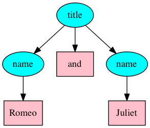
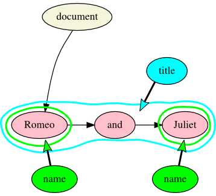

# XML and OHCO

## OHCO enthusiasm

XML is based on the OHCO model. The origin of the OHCO (ordered hierarchy of content objects) thesis is commonly traced to Steve DeRose, David Durand, Elli Mylonas, and Allen Renear’s 1990 “What is text, really?”, which said that:

> … text is best represented as an ordered hierarchy of content objects (OHCO), because that is what text really is.
 
The authors defined the components of this acronym as follows:

**Content objects:**

> The essential parts of any document form what we call “content objects,” and are of many types, such as paragraphs, quotations, emphatic phrases, and attributions. Each type of content object usually has its own appearance when a document is printed or displayed, but that appearance is superficial and transient rather than essential—it is the content elements themselves, along with their content, which form the essence of the document. When mnemonic names for these objects are specified, a document is said to include “descriptive markukp.”

**Hierarchy:**

> Most content objects are contained in larger content objects, such as subsections, sections, and chapters. In the above example, the paragraph contains two quotations, the second of which contains an emphatic element. Generally, smaller content objects do not cross the boundaries of larger ones; thus a paragraph will not begin in one chapter and end in the next. For this reasonm the structure of a document is a hierarchical one, like a tree or taxonomy.

**Ordered:**

> Smaller content objects that occur within a larger one, such as the sections within a chapter, or the paragraphs, block quotes, and other objects within a section, occur in a certain order. This ordering is essential information, and must he part of any model of text structure.

While the categories are defined in ontological terms, a large part of the article is about the engineering benefits of modeling text as OHCO, which is different from (and at least partially independent of) “what text really is”. The major section title for this portion of their article is “Advantages of OHCO-based text processing”, with subsections entitled “Advantages for authoring”, “Advantages for production”, and “Turning text into a database”. These arguments, which are all meritorious, do not contradict the ontological perspective, but they do suggest that arguments about what text really is in 1990 were about more than ontology.

## Second thoughts about hierarchy

In 1993 three of the original authors of the 1990 study returned to qualify their original enthusiasm for OHCO because of the challenge posed by overlapping hierarchies. The source of this reconsideration is that (drawing on Barnard, et al. 1988):

> … there are many features of interest to scholars which taken together do not form a single hierarchy, but which nevertheless all seem plausibly “logical”. Consider a verse drama for instance. It contains dialogue lines (speeches), metrical lines, and sentences. But object such as these do fit in a single hierarchy of non-overlapping objects: sentences and metrical lines obviously overlap (enjambment) and when a character finishes another character’s sentence or metrical line then dialogue lines overlap with sentences and metrical lines. 
 
The 1993 article concludes that:

> … although we have retreated from the simple OHCO thesis, we note that the spirit of the OHCO hypotheses is borne out to the extent that texts qua intellectual objects still seem to be composed of structures of meaning-related features and that, moreover, these structures are often hierarchical.

## More about hierarchy: containment and dominance

Overlapping hierarchy is a well-known challenge to OHCO for which many workarounds have been proposed, but a related issue is that some document components may not be hierarchical at all, at least in any meaningful way. For example, Jeni Tennison distinguishes containment from dominance with the following example (framed in terms of [LMNL](https://github.com/Pittsburgh-NEH-Institute/Institute-Materials-2017/blob/master/schedule/week_2/other_models.md) ranges):

> Containment is a happenstance relationship between ranges while dominance is one that has a meaningful semantic. A page may happen to *contain* a stanza, but a poem dominates the *stanzas* that it contains.

This statement does not deny the existence of overlapping hierarchies (for example, a book of poems might be said to dominate both a sequence of poems and a sequence of pages, each of which constitutes an independent hierarchy rooted in the book), but it does make it possible to treat containment as non-hierarchical—or, at least, as a different type of hierarchy than dominance.

## Order

Most of the challenges to OHCO have involved hierarchy, but order is also not an inalienable property of all textual objects. As discussed in [Data model](https://github.com/Pittsburgh-NEH-Institute/Institute-Materials-2017/blob/master/schedule/week_2/model_syntax_semantics.md), XML models documents as ordered trees of nodes, except that attributes on elements are not ordered, and neither are namespace nodes. But although element children in XML are ordered, the TEI `<choice>` element, for example, wraps child elements that have no logical mutual order, such as abbreviations and their expansions or errors and their corrections. The order of the child elements of `<choice>` is artifactual, and it distorts the ability of the model to represent what the text really is. More specifically, two TEI documents that differ only in the order of the children of their `<choice>` elements are not deep equal, although those that differ only in the order of their attributes are—even though the order is not informational in either case. 

As far as we can tell, the reality is that to the extent that text is a tree (or set of trees), it is *partially* ordered, while XML is *fully* ordered. And although the order can be ignored during processing, that happens at the application layer and requires semantic information that is external to the XML model. In other words, order does not always model what text really is. 

## Content objects

Not only is order sometimes artifactual in XML, but so are some elements, that is, content objects. For example, the `<choice>` element that wraps an abbreviation and its expansion is not a content object itself; it uses a content object to bind the abbreviation to its expansion, but the reason it needs to do that is to communicate, through markup semantics, that, among other things, the child elements in this case have a relationship that is not ordered. The same is true of the `<app>` element in TEI parallel segmentation critical edition markup; the `<rdg>` child elements represent the fact of variation, and the `<app>` wrapper binds them together as an unordered set of options. 

Consider also a title like “Romeo and Juliet”, which might be tagged in XML as:

```xml
<title><name>Romeo</name> and <name>Juliet</name></title>
```

which in tree form would look like:



Here the `<name>` elements might reasonably be considered content objects, but representing them as such compromises the hierarchy, which is no longer a string of three words, but now a sequence of two `<name>` elements with a `text()` node between them, and the `text()` nodes that contain the text of the names are on a different hierarchical level than the conjunction. The data models of LMNL and TAG are not obligatorily hierarchical, so you can tag the names without pushing the three words onto two different hierarchical levels. For comparison, here is the TAG hypergraph representation of the Romeo and Juliet phrase:



## Conclusions

It would be perverse to argue that text is not ordered, that it is not hierarchical, and that it does not consist of identifiable content objects, because to some extent it _is_ all of these things. But text is _more_ than an ordered hierarchy of content objects. 

The original 1990 OHCO paper compares the OHCO model favorably and correctly to alternatives that were in use at that time. But in the more than quarter century that has elapsed since 1990, we now recognize that the challenges to OHCO go beyond overlapping hierarchies, and invite a more nuanced engagement not only with the “H”, but also with the “O” and the “CO” of OHCO.

## Works cited

Several of the arguments and illustrations above are taken from Ronald Haentjens Dekker and David J. Birnbaum, [“It’s more than just overlap: Text As Graph”.](balisage-tag/Bal2017dekk0505.html) Other sources cited above are:

Barnard, David, Ron Hayter, Maria Karababa, George Logan, and John McFadden. “SGML-based markup for literary texts: two problems and some solutions.” *Computers and the humanities*, Vol. 22, No. 4 (1988), pp. 265–76. <http://www.jstor.org/stable/30200136>.

DeRose, Steven J., David G. Durand, Elli Mylonas, and Allen H. Renear. “What is text, really?”, *Journal of computing in higher education*, 1.2 (1990): 3–26. doi:10.1007/BF02941632. <http://www.cip.ifi.lmu.de/~langeh/test/1990%20-%20DeRose%20-%20What%20is%20Text,%20really%3F.pdf>.

Renear, Allen H., Elli Mylonas, and David G. Durand. “Refining our notion of what text really is: the problem of overlapping hierarchies.” *Research in humanities computing*, ed. Nancy Ide and Susan Hockey. Oxford: Oxford University Press. 1996. <http://cds.library.brown.edu/resources/stg/monographs/ohco.html>.

Tennison, Jeni. “Overlap, containment and dominance. Jeni’s musings, 2008-12-06.” <http://www.jenitennison.com/2008/12/06/overlap-containment-and-dominance.html>

