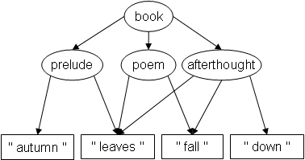
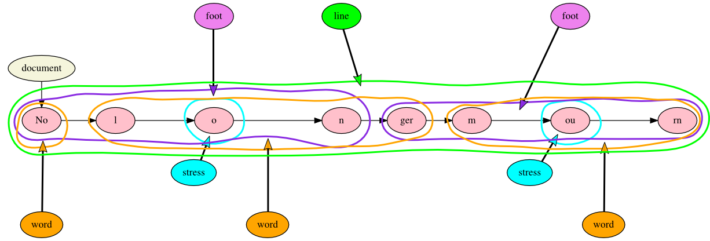
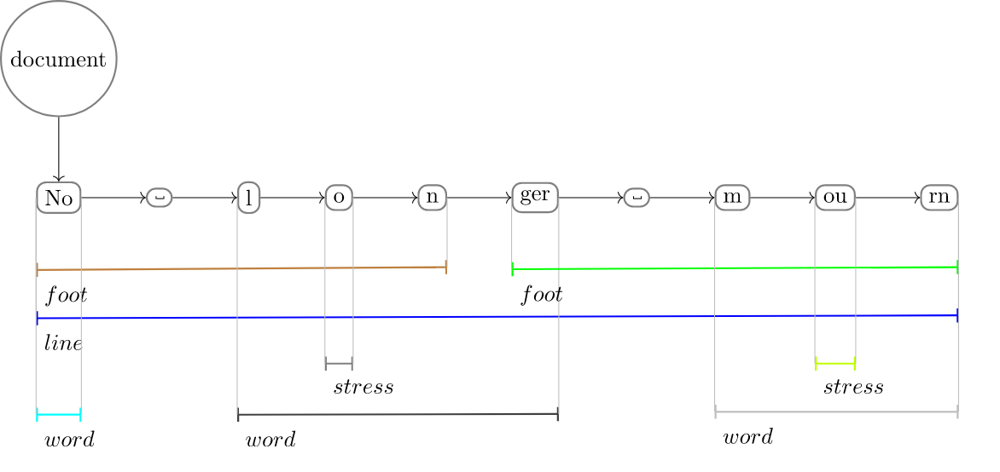

# Other models and expressions

This section discusses other data models and how they express textual features. Most data models have been developed to deal with specific textual features that are difficult to model in XML, such as overlap. We maintain that digital editors do not need to be well-versed in each data model, but that it is valuable to have an understanding of the specific features and strengths of alternative models in order to avoid a too narrow focus on existing technologies, as the prevalent use of TEI/XML may blind us for textual characteristics that are not part of the TEI model. Below we discuss three alternative data models and their syntax: LMNL, GODDAG and TexMECS, and TAGML.

## LMNL: Layered Markup and Annotation Language

Structure is expressed through *ranges* over *atoms* (typically textual characters). LMNL is a data model, which can be represented with *sawtooth* syntax, but the data model is primary, and the syntax is just illustrative.

```
[excerpt [source}The Housekeeper{] [author}Robert Frost{]}
[s}[l [n}144{n]}He manages to keep the upper hand{l]
[l [n}145{n]}On his own farm.{s] [s}He's boss.{s] [s}But as to hens:{l]
[l [n}146{n]}We fence our flowers in and the hens range.{l]{s]
{excerpt]
``` 

For more information see Wendell Piez, [LMNL in miniature. An introduction.](http://piez.org/wendell/LMNL/Amsterdam2008/presentation-slides.html), which is the source of the example.

## GODDAG: General Ordered-Descendant Directed Acyclic Graph

GODDAG is a data model for representing documents with overlapping structures, which permits children to have multiple parents. Consider the following minimalist poem:



Image from Yves Marcoux, [Graph characterization of overlap-only TexMECS and other overlapping markup formalisms](http://www.balisage.net/Proceedings/vol1/html/Marcoux01/BalisageVol1-Marcoux01.html). For more information see C. M. Sperberg-McQueen and Claus Huitfeldt, [GODDAG: A data structure for overlapping hierarchies](http://cmsmcq.com/2000/poddp2000.html).

## TexMECS

TexMECS is a markup system (syntax) designed to be able to represent overlap. The GODDAG data model is intended to be able to process documents tagged according to TexMECS. The preceding poem can be represented in TexMECS as:

```
<book|
  <prelude|
    autumn
  <poem|
  <afterthought|
    leaves
  |prelude>
    fall
  |poem>
    down
  |afterthought>
|book>
```

Example from Yves Marcoux, [Graph characterization of overlap-only TexMECS and other overlapping markup formalisms](http://www.balisage.net/Proceedings/vol1/html/Marcoux01/BalisageVol1-Marcoux01.html). For more information see Claus Huitfeldt and C. M. Sperberg-McQueen, [TexMECS. An experimental markup meta-language for complex documents](http://mlcd.blackmesatech.com/mlcd/2003/Papers/texmecs.html).

## TAG: Text as Graph

TAG is a data model based on a hypergraph. The following image illustrates how information about words, stress, lines, amd metrical feet might be represented for a minimal poem consisting of the single line “No longer mourn”.



Alexandria Markup, an open source TAG application, visualizes this document as follows:



For more information see Ronald Haentjens Dekker and David J. Birnbaum, [It’s more than just overlap: Text As Graph”](https://pittsburgh-neh-institute.github.io/Institute-Materials-2017/schedule/week_2/balisage-tag/Bal2017dekk0505.html), which is the source of the example. 