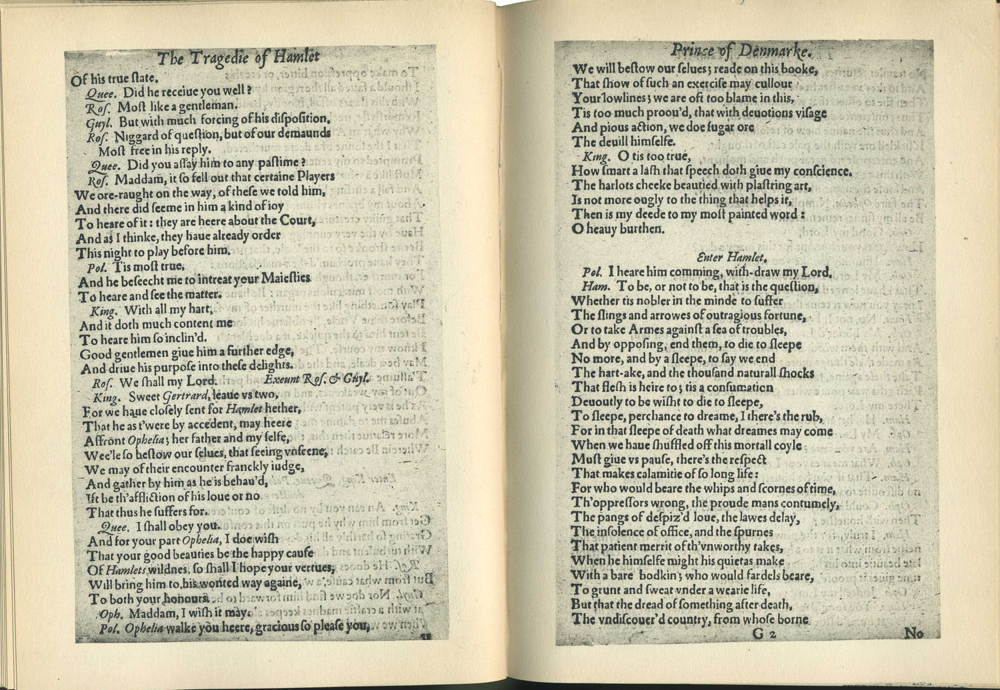
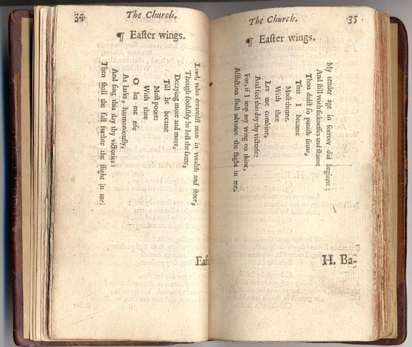

# Plain text as model and expression

Here are two printed images that conform to conventional typographic conventions, plus one that doesn’t. How is structure expressed through layout and typography?

## William Shakespeare, *Hamlet* (Second Quarto, 1604/1605)

The quartos are early publications of some of Shakespeare’s plays. You can explore the *Hamlet* quartos at [The Shakespeare Quartos Archive](http://www.quartos.org/).

[Image from <http://liblamp.uwm.edu/omeka/SPC2/exhibits/show/classictext/shakespeare/shakespeare1604>]

## Percy Bysshe Shelley, “Ozymandias” (First publication, 1818)

From <https://en.wikipedia.org/wiki/Ozymandias>:

> “Ozymandias” … is a sonnet written by English Romantic poet Percy Bysshe Shelley (1792–1822), first published in the 11 January 1818 issue of *The Examiner* in London. It was included the following year in Shelley's collection *Rosalind and Helen, a modern eclogue; with other poems* (1819) and in a posthumous compilation of his poems published in 1826.

[Image from <https://en.wikipedia.org/wiki/Ozymandias#/media/File:Ozymandias_The_Examiner_1818.jpg>]

## George Herbert, “Easter wings” (1633)

George Herbert’s “Easter wings” was printed in a wing-like layout.

[Image from <https://www.ccel.org/h/herbert/temple/Easterwings.html>]