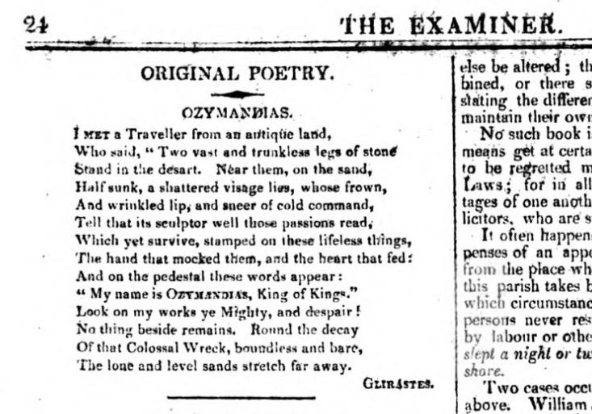

# Plain text as model and expression

Here are two printed images that conform to normal typographic conventions, plus one that doesn’t. How is structure expressed through layout and typography?

## William Shakespeare, *Hamlet* (Second Quarto, )

[Image from <http://liblamp.uwm.edu/omeka/SPC2/exhibits/show/classictext/shakespeare/shakespeare1604>]

## Percy Bysshe Shelley, “Ozymandias” (First publication, 1818)

[Image from <https://en.wikipedia.org/wiki/Ozymandias#/media/File:Ozymandias_The_Examiner_1818.jpg>]

## George Herbert, Easter-wings (1633)

[Image from <https://www.ccel.org/h/herbert/temple/Easterwings.html>]