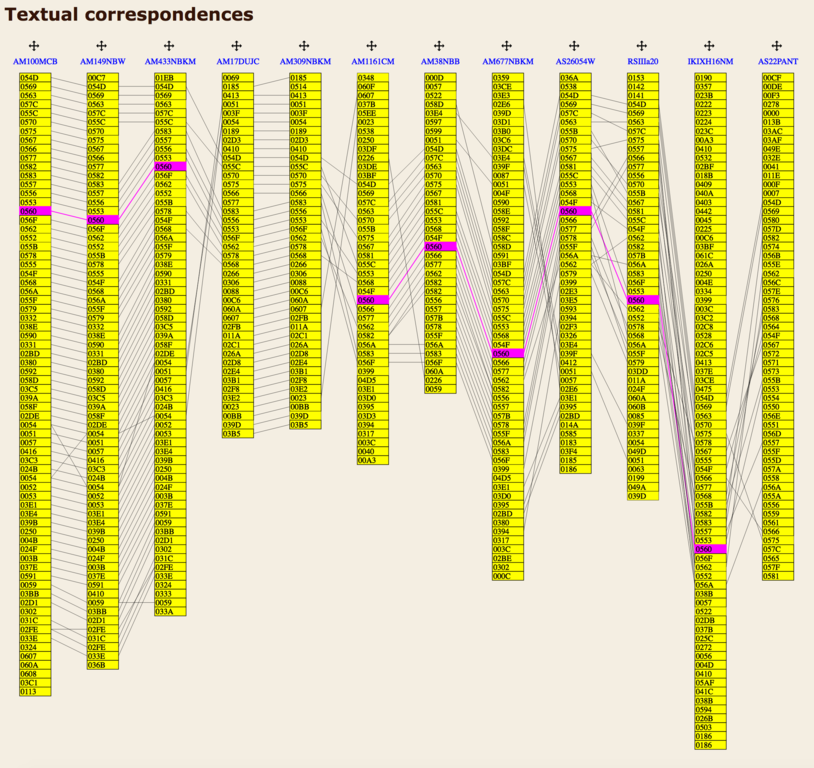

# What story are you trying to tell?

The following digital projects incorporate original visual representations of the structure and contents of the documents. What stories do these visualizations tell?

## Comparative visualizations

Comparative visualizations are designed to explore textual variation.

### Commentary on the Sentences by Petrus Plaoul

**URL:** <http://petrusplaoul.org/text/questions/plaoulcommentary/>

Materials for an eventual critical edition of the Sentences commentary of Peter Plaoul. The distributed nature of scholastic commentaries invites their publication as data, rather than documents, utilizing Linked Open Data and IIIF. See also the [SCTA reading room](http://scta.lombardpress.org/), a description of the [technical details](http://scta.info/technical-details), [Lombard Press](http://lombardpress.org/), and the video presentation of [“Digital scholarly editions and API consuming applications”](http://lombardpress.org/2016/11/02/dse-and-api-consuming-applications/),

### Daniel the Prisoner: A virtual florilegium

**URL:** <http://zatochnik.obdurodon.org/>

There are two main redactions or versions, the twelfth-century _Slovo Daniila Zatočnika_ (“Word of Daniel the Prisoner”) and the thirteenth-century _Molenie Daniila Zatočnika_ (“Supplication of Daniel the Prisoner”). Although the textual core of both texts consists largely of the same material, the two redactions (and even manuscripts within the redactions) differ significantly in their use and arrangement of this material. Either one could have been compiled from the other. Indeed it may be said that the “Daniel” texts, like other florilegia, defeat traditional textual criticism: while the _Slovo_ may reflect an earlier arrangement of textual material, the _Molenie_ may be primary at the micro-level, in places more closely reflecting its sources than the Slovo. For a guide to interacting with the interface, navigate to the [about page](http://zatochnik.obdurodon.org/about.html) and scroll down to the annotated screen capture.

### Digenis Akritis: Lay of the Emir

**URL:** <http://digenis.obdurodon.org/emir.xhtml>

The seventeenth-century Slavonic text has been reordered to model a hypothetical fourteenth-century Slavonic source that stands closer to the reconstructed Greek _common core_ of the tradition. In the full view of the *plectogram* at the top of the page, the Greek structure is on the bottom row, the reconstructed fourteenth-century Slavonic in the middle, and the extant seventeenth-century Slavonic at the top. Circled sections of the Greek were not continued in the Slavonic; other Greek sections are divided because their parts, which are adjacent in the fourteenth-century reconstruction, were separated or otherwise rearranged by the seventeenth century. The flyout menu (upper right) toggles between Slavonic and English, and also toggles the visibility of the Greek and the seventeenth-century Slavonic (the fourteenth-century text, the focus of the edition, is always visible). An [about page](http://digenis.obdurodon.org/emir_about.xhtml) explaining the rationale of the edition is also accessible from the menu.

### The story of Mary, Abraham’s niece

**URL:** <http://bdinski.obdurodon.org/tmp/mockup-abraham-2.xhtml>

Mockup of a reading view that coordinates Slavonic, Greek, and English texts with an interlinear collation of the Slavonic witnesses. Only Unit 3 is active. Clicking on a Slavonic verse in the upper left highlights the Greek and English to the right and loads the manuscript variants for that verse below. In the gray bar to the right of the lower pane, the D/N radio button toggles between diplomatic and normalized transcriptions, and the checkboxes toggle the visibility of individual witnesses. Clicking on the witness siglum to the right goes to a facing diplomatic transcription and photographic facsimile of the page (currently implemented only for BdSb). Color coding has been added manually to highlight important moments; the specific colors are not meaningful.

### Repertorium workstation

**URL:** <http://repertorium.obdurodon.org/>

The *Repertorium of Old Bulgarian literature and letters* is a metadata project designed to support the study of the structure of mixed-content miscellany manuscripts. In includes [*dendrogram* visualizations](http://repertorium.obdurodon.org/dendrogram-colored.xhtml?lg=bg) of similarlities in the structure and contents of the corpus (currently 161 manuscripts), and on-demand comparative *plectogram* visualizations of the contents of individual manuscripts (simplified mockup at <http://repertorium.obdurodon.org/dev/test.xhtml?lg=bg>).

### StemmaWeb

**URL:** <https://stemmaweb.net/stemmaweb/>

StemmaWeb offers interactive visual tools for exploring and editing models of relationships within a textual tradition. See the [sample](https://stemmaweb.net/stemmaweb/relation/660ED478-0BC7-11E2-B8F4-3E7CDE76481A?) (click on the “Help/About” button for a guide to the interface) or start at the [main page](https://stemmaweb.net/stemmaweb/) and explore all of the features.

### CATview

**URL:** <http://catview.uzi.uni-halle.de/>  

 

CATview was developed by the [working group on eHumanities of the Computer Science Institute of Martin Luther University Halle-Wittenberg](http://www.informatik.uni-halle.de/ti/forschung/ehumanities/) to visualize textual variation at different degrees of granularity. On a macrolevel view (the first image above), the witnesses are displayed horizontally with different rectangles representing a segment of text like a word, phrase, or paragraph, which allows the user to identify locations where text is present in some but not all witnesses. Alternatively (the second image above), users can zoom in for a closer look the text. Here segments are aligned vertically (in columns); darker shading indicates a greater degree of textual of similarity.

### TRAViz

**URL:** <http://www.traviz.vizcovery.org/>

<!---->

TRAViz is a set of [JavaScript packages](https://github.com/stjaenicke/TRAViz) primarily intended to render variant graphs, and it offers an elaborate variant graph visualization. Among other things, TRAViz lets users interact with the graph and adjust it to match their needs and interests.

### Faust

**URL:** <http://beta.faustedition.net/>  

  

  

A comprehensive overview of the genesis of *Faust* by Johann Wolfgang von Goethe is presented in the form of interactive diagrams that show the writing process of the entire work. The diagram resembles a conventional genetic plan, but with each mouse-click readers/users can dive more deeply into the texts of *Faust*: the work is first divided into *Faust I*, *Faust II*, and *Paralipomena* (first image above). Clicking on one of the bars shows a further division into separate acts and scenes. The horizontal axis of the second diagram represents the verses of the base text; the vertical axis contains the different sigla, representing either a version of the work or a paralipomenon (indicated by a siglum starting with a “P”). 

### A prototype of Beckett’s *L’Innommable* 

**URL:** <http://www.beckettarchive.org/writingsequenceofinnommable.jsp>

  

The BDMP presents a macrolevel perspective on the development of the work *L’Innomable* by visually juxtaposing the draft manuscript (consisting of two notebooks) and the base text (i.e., the first published text, in this case Editions de Minuit in 1953). The visualization is intended to elucidate the relationship between the draft manuscript and the published text, and to visualize the temporal aspect of a text’s genesis. It is a dynamic visualization: users can choose to render the sentences as ordered on the page of the manuscript, that is, in the writing order, as they appear in the published text, i.e., the reading order.

Access to some of the materials in the BDMP is restricted for reasons of copyright, but the URL above points to a page with links to freely accessible features.

## Close reading visualizations

Close reading visualizations are designed to explore structural and other properties of individual texts.

### Russian verse

**URL:** <http://poetry.obdurodon.org>

*Meter, rhythm, rhyme* is a project for exploring the history of Russian versification. Stressed vowels (not strong metrical positions) are red. In Meter column, X = stressed and O = unstressed (again, not strong and weak). The pipe represents a foot boundary and the double pipe (where relevant) a caesura. Parentheses indicate hypermetrical syllables. Rhyme is masculine (lowercase), feminine (uppercase), or dactylic (uppercase followed by prime). Stressed vowels are color coded to make patterns easier to discern. The line graph shows the percentage of times a particular syllabic position in a line is stressed over the course of the poem.  

### Beckett Digital Manuscript Project

**URL:** <http://www.beckettarchive.org/>  

For most philologists, an alignment table is a natural or familiar format to present interdocumentary variation. The collation result is presented in tabular format where witnesses are displayed vertically or horizontally. Each cell contains one or several tokens, and if a token has no match an empty cell is introduced (a “gap”) to align the surrounding tokens visually. As this example alignment table from the *Beckett Digital Manuscript Project (BDMP)* shows, it is possible to pass along and to visualize markup (the deletions in Version 11), which results in a more informative alignment table.  

### Proust (prototype) 

**URL:** <http://research.cch.kcl.ac.uk/proust_prototype/>

Julie André and Elena Pierazzo created an animated prototype of an opening of one of Marcel Proust’s notebooks. The visualization is *ultra-diplomatic* in that it tries to replicate the layout of the manuscript page as closely as possible. A unit of text is defined by the moment when it was written, so units vary from one sentence to a few paragraphs. The visualization reproduces how the transcription of each separate unit is plotted on a zone of a document page. The transcription includes line breaks and mimics the distribution of the text over the page. 

### Animated Variants

**URL:** <http://individual.utoronto.ca/alangaley/visualizingvariation/animated.html>  

Though not a graph nor a diagram, Alan Galey’s Animated Variants visualization tool deserves special mention here. Textual variance is represented within a sentence in an active manner, by switching among variant words in place. The tool makes a virtue of a text’s ambiguity, emphasizing Galey’s point that no variant is fixed. In this example, that ambiguity is expressed visually by changing among the words “solid”, “sallied”, and “sullied”.