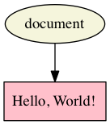

# Text As Graph (TAG)

The Text As Graph (TAG) model conceptualizes of documents as a *hypergraph* for text. 

As you may be unfamiliar with a hypergraph model, we will briefly outline its key points. A *graph* consists of nodes and edges, where the edges connect one node to another. A hypergraph contains both regular edges, which connect one node to one other node, and *hyperedges*, which connect a *set of nodes* to another *set of nodes*. For more information about modeling text as a hypergraph see [“It’s more than just overlap: Text As Graph”](https://www.balisage.net/Proceedings/vol19/html/Dekker01/BalisageVol19-Dekker01.html) <!--- add reference to 2018 Balisage paper here the moment we got it -->

## Why are we looking at TAG?

The only document model in wide use in digital editions projects is XML, which is the only technology that has sufficient maturity and a sufficiently large community to be practical for general production purposes. The reason we nonetheless introduce TAG (and [LMNL](lmnl_syntax.md)) is that looking at non-XML ways of modeling documents encourages developers to think first about the model, and then about the relationship of the model to the syntax. In other words, thinking about how to model documents in LMNL and TAG can improve the quality of our models, whether we use XML or an alternative.

This tutorial is based on the first version of TAG, which has undergone several changes since it was introduced (e.g., directed Text-to-Text edges have been replaced by undirected ones; TAGML serves as a markup language for TAG, etc.). The differences are not important for the purpose of using TAG to encourage critical thinking about document modeling, so we have kept the original description, even though it has now been superseded in some respects. Up-to-date information about TAG is maintained at the [TAG portal on GitHub](https://github.com/HuygensING/tag).

## TAG counterparts to XML `text()` nodes

The text in a TAG document is a sequence of Text nodes, where the sequence begins with a Document node. The simplest TAG document, which contains only text and no markup, looks something like:



## TAG Markup-to-Text hyperedges

TAG is a data model that does not (yet) have its own markup language, but the [Alexandria](../week_3/alexandria.md) implementation of TAG is capable of importing documents that have been marked up using LMNL sawtooth syntax. In this context, the sawtooth syntax is used to represent parts of the TAG hypergraph model, rather than the LMNL range model. The fact that the same syntax can be used to represent features of two data models highlights the difference between the data model and the syntax.

Below we add just a single Markup node (with a `name` property of “stuff”) which TAG represents with a hyperedge that points from the Markup node to the Text node. In LMNL markup this looks like:

```
[stuff}Hello, World!{stuff]
```

Alexandria visualizes this TAG structure as:


In the LMNL model, “stuff” would be the name of a range that is expressed over the text. In TAG, “stuff” is a Markup node that serves as the head of a hyperedge, and the tail in this case contains a single Text node. Because Markup nodes and Text nodes are related by a hyperedge, which can connect more than one node on either end, a Markup node in TAG may point to one or more than one Text node.

## Dividing text into Text nodes in TAG

With LMNL, as with XML, the document text is divided into Text nodes according to the markup structure, so that there are no adjacent Text nodes that have exactly the same markup. Here we tag the two names in the title _Romeo and Juliet_:

```
[title}[name}Romeo{name] and [name}Juliet{name]{title]
```

The visualization below shows that the text has been divided into three Text nodes in order to accommodate the markup. This TAG document contains the following objects:

* One Document node.
* Three Text nodes, with the values “Romeo”, “&#x0a; and &#x0a;” (note the spaces on either side of the conjunction), and “Juliet”.
* The Document node and the three Text nodes are connected by regular (one-to-one) edges into a chain that connects all of the text in the document in order.
* There are three Markup nodes (comparable to element nodes in XML), two of type “name” and one of type “title”. These Markup nodes are connected to Text nodes or groups of Text nodes by an edge. In this example the two Markup nodes of type “name” are connected to Text nodes with the value “Romeo” and “Juliet”, and the Markup node of type “title” is connected to all three text Nodes:


## TAG and overlap

TAG addresses the problem of overlap by enforcing *containment* rather than *dominance*. In XML, the two ideas are not differentiated. If one element contains other elements, it is necessarily the only parent of those elements. This means no sibling or ancestor element can contain the children of that element. The following illustrates a TAG representation of two line of Percy Bysshe Shelley’s “Ozymandias”:


In plain text, the lines are:

> Who said—“Two vast and trunkless legs of stone  
> Stand in the desart …. Near them, on the sand,
 
In this example, Markup nodes of type “phrase” and their associated hyperedges are green, and those of type “line” are cyan. The phrase “Two vast and trunkless legs of stone stand in the desart” is split between two lines, each of which also contains other phrases. There is no valid way to mark this up in XML except by prioritizing one hierarchy (phrases or lines) and representing the other with empty milestones. In TAG, however, neither hierarchy is primary; phrases and lines both contain Text nodes, and both types of relationships are encoded in the same way. (See also a [complete graphic representation of “Ozymandias”](images/ozymandias_hypergraph.svg), generated by Alexandria.)

## Curious about TAG?

As noted above, up-to-date information about TAG is maintained at the [TAG portal on GitHub](https://github.com/HuygensING/tag).
