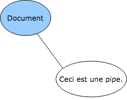
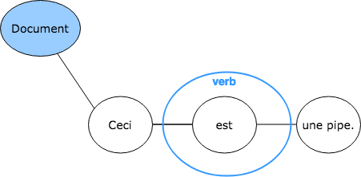
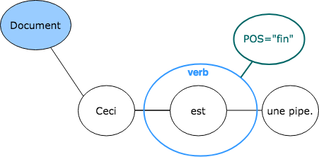
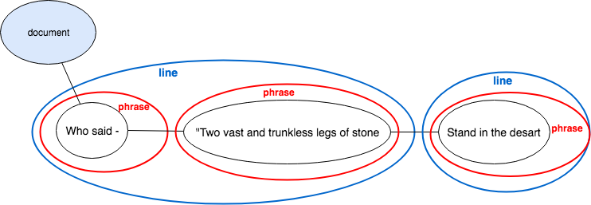
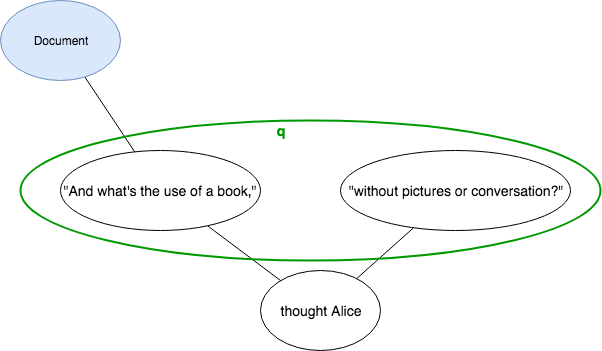
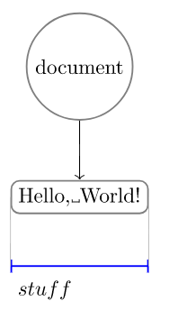
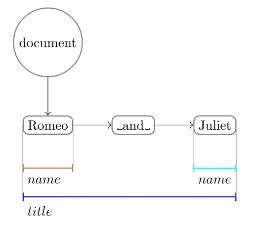
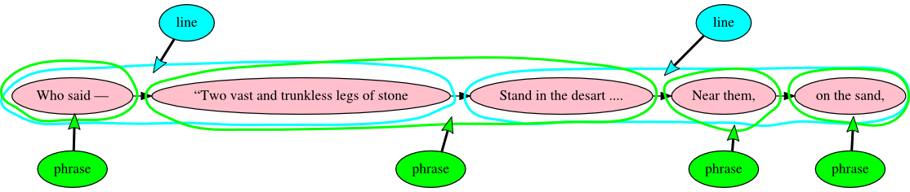

# Text As Graph (TAG)

The Text As Graph (TAG) model conceptualizes of documents as a *hypergraph* for text. As you may be unfamiliar with a hypergraph model, we will briefly outline its key features. Like any *graph*, a hypergraph consists of nodes and edges, where the edges connect one node to another. A hypergraph contains both regular edges, which connect one node to one other node, and *hyperedges*, which connect a *set of nodes* to another *set of nodes*. 

You can find more information about modeling text as a hypergraph in [“It’s more than just overlap: Text As Graph”](https://www.balisage.net/Proceedings/vol19/html/Dekker01/BalisageVol19-Dekker01.html). <!--- add reference to 2018 Balisage paper here the moment we got it --> For now, keep in mind that the hypergraph is a powerful data structure that allows you to represent a greater quantity of textual information in an inclusive and more refined way.

## Why are we looking at TAG?

The only document model in wide use in digital editions projects is XML, which is the only technology that has sufficient maturity and a sufficiently large community to be practical for general production purposes. The reason we nonetheless introduce TAG (and [LMNL](lmnl_syntax.md)) is that looking at non-XML ways of modeling documents encourages us to think first about the model, and then about the relationship of the model to the syntax. In other words, thinking about how to model documents in LMNL and TAG can improve the quality of our models, whether we use XML or an alternative.

A study of TAG's features, therefore, serve the purpose of encouraging critical thinking about document modeling. The TAG model is under active development, so in the following paragraphs we will not discuss its syntax, query language or schema, but we focus on the properties of the data model. 

## TAG edges
The TAG data model distinguishes a number of different edges; below we describe just the two main ones. 

### TAG undirected edges
All edges in TAG's hypergraph are undirected. The graph models you may be more familiar with, such as a variant graph, have directed edges. This means the edges can only be traversed from node A to node B. Undirected edges, conversely, can be traversed in both ways.

### TAG hyperedges
TAG uses hyperedges to associate markup with its textual content. Hyperedges can connect one or more nodes with each other, in contrast to regular edges that connect one node to another node. This means that there can be multiple Markup nodes on one Text node. An example of a hyperedge is given below.

## TAG Nodes

The TAG model distinguishes four kinds of nodes in the hypergraph. They are briefly described below and illustrated using a simple example.

### TAG Document node
The Document node represents a single TAG document. It marks the start of a sequence of Text nodes and serves as a root node. See the root node in the image below.

### TAG Text nodes

A Text node represents (a part of) the textual content of the document. Whitespace is included in the textal content. The simplest TAG document, which contains only text and no markup, looks something like:



### TAG Markup nodes
Markup nodes store the name of the markup. They are connected to one or more Text nodes with an hyperedge. In the figure below, the hyperedge connects the Markup node `verb` with the Text node containing `est`.



### TAG Annotation nodes
Annotations in TAG are comparible to XML attributes. Information is stored as a key:value pair. Annotation nodes have two properties: the name of the annotation (the key) and the value of the annotation (the value). 

Below an illustration of an annotation with the key `POS` and the value `fin` on the Markup node:




## Modeling text in TAG
We mentioned above that the properties of the hypergraph for text data model cater for the modeling of complex text features. In other words: what's hard in XML is not hard in TAG. 

Let's take a look at the textual examples we used when illustrating [the limitations of XML](https://github.com/Pittsburgh-NEH-Institute/Institute-Materials-2017/blob/master/schedule/week_2/xml_limitations.md) and see how they translate to TAG. 

### Overlap

Consider a fragment of Percy Bysshe Shelley’s “Ozymandias” (1818):

 
> Who said—“Two vast and trunkless legs of stone  
> Stand in the desart ...

What in a XML transcription leads to overlapping structures and thus not well formed XML:

```xml
<line><phrase>Who said —</phrase> <phrase>“Two vast and trunkless legs of stone</line>
<line>Stand in the desart….</phrase></line>
```

is easily expressed in TAG:



The phrase “Two vast and trunkless legs of stone stand in the desart” is split between two lines, each of which also contains other phrases. There is no valid way to mark this up in XML except by prioritizing one hierarchy (phrases or lines) and representing the other with empty milestones. In TAG, however, neither hierarchy is primary; phrases and lines both contain Text nodes, and both types of relationships are encoded in the same way. (See also a [complete graphic representation of “Ozymandias”](images/ozymandias_hypergraph.svg), generated by Alexandria.)

### Discontinuity

```xml
<q>"and what is the use of a book,"</q> thought Alice  <q>"without pictures or conversation?"</q>
```

can be modeled in TAG:



## TAG syntax
TAGML stands for _TAG Markup Language_ and, as syntax, it is a serialization of the TAG model. It is designed to represent in a straightforward manner all features of a text. 

A simple TAGML example is:

```
[line>The rain in Spain falls mainly on the plain.<line]
```

with the `[line>` being the start-tag and the `<line]` being the end-tag. For every start-tag there should be an end-tag, and vice versa. 

## Curious about TAG?

As noted above, up-to-date information about TAG is maintained at the [TAG portal on GitHub](https://github.com/HuygensING/tag). Also take a look at the [Balisage 2018 paper](https://www.balisage.net/Proceedings/vol21/html/HaentjensDekker01/BalisageVol21-HaentjensDekker01.html) for more details on TAGML and its relation to existing markup languages.


<!--- ### TAG hyperedges

TAG is a data model that does not (yet) have its own markup language, but the [Alexandria](../week_3/alexandria.md) implementation of TAG is capable of importing documents that have been marked up using LMNL sawtooth syntax. In this context, the sawtooth syntax is used to represent parts of the TAG hypergraph model, rather than the LMNL range model. The fact that the same syntax can be used to represent features of two data models highlights the difference between the data model and the syntax.

Below we add just a single Markup node (with a `name` property of “stuff”) which TAG represents with a hyperedge that points from the Markup node to the Text node. In LMNL markup this looks like:

```
[stuff}Hello, World!{stuff]
```

Alexandria visualizes this TAG structure as:



In the LMNL model, “stuff” would be the name of a range that is expressed over the text. In TAG, “stuff” is a Markup node that serves as the head of a hyperedge, and the tail in this case contains a single Text node. Because Markup nodes and Text nodes are related by a hyperedge, which can connect more than one node on either end, a Markup node in TAG may point to one or more than one Text node.

## Dividing text into Text nodes in TAG

With LMNL, as with XML, the document text is divided into Text nodes according to the markup structure, so that there are no adjacent Text nodes that have exactly the same markup. Here we tag the two names in the title _Romeo and Juliet_:

```
[title}[name}Romeo{name] and [name}Juliet{name]{title]
```

The visualization below shows that the text has been divided into three Text nodes in order to accommodate the markup. This TAG document contains the following objects:

* One Document node.
* Three Text nodes, with the values “Romeo”, “&#x0a; and &#x0a;” (note the spaces on either side of the conjunction), and “Juliet”.
* The Document node and the three Text nodes are connected by regular (one-to-one) edges into a chain that connects all of the text in the document in order.
* There are three Markup nodes (comparable to element nodes in XML), two of type “name” and one of type “title”. These Markup nodes are connected to Text nodes or groups of Text nodes by an edge. In this example the two Markup nodes of type “name” are connected to Text nodes with the value “Romeo” and “Juliet”, and the Markup node of type “title” is connected to all three text Nodes:



## TAG and overlap

TAG addresses the problem of overlap by enforcing *containment* rather than *dominance*. In XML, the two ideas are not differentiated. If one element contains other elements, it is necessarily the only parent of those elements. This means no sibling or ancestor element can contain the children of that element. The following illustrates a TAG representation of two line of Percy Bysshe Shelley’s “Ozymandias”:



In plain text, the lines are:

> Who said—“Two vast and trunkless legs of stone  
> Stand in the desart …. Near them, on the sand,
 
In this example, Markup nodes of type “phrase” and their associated hyperedges are green, and those of type “line” are cyan. The phrase “Two vast and trunkless legs of stone stand in the desart” is split between two lines, each of which also contains other phrases. There is no valid way to mark this up in XML except by prioritizing one hierarchy (phrases or lines) and representing the other with empty milestones. In TAG, however, neither hierarchy is primary; phrases and lines both contain Text nodes, and both types of relationships are encoded in the same way. (See also a [complete graphic representation of “Ozymandias”](images/ozymandias_hypergraph.svg), generated by Alexandria.)

## Curious about TAG?

As noted above, up-to-date information about TAG is maintained at the [TAG portal on GitHub](https://github.com/HuygensING/tag). -->
