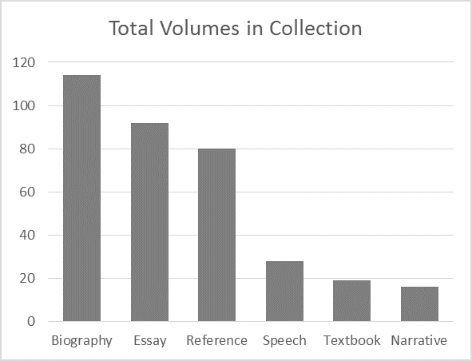

# Visualization as a view of the document

## Text and image are both views of information

Textual editions understandably foreground textual content, but at a higher level the text is a *representation* of information, and information may be represented in different ways. For example, a visual image, such as a chart or graph, is also a representation, and a graphic visualization may be considered a view of the document alongside the more obvious textual view. Graphic visualizations may sometimes offer a summary view of information that is so voluminous or complex that the words would interfere with the message. And graphic and textual views may also refer to one another, so that a graphic visualization may serve as a navigational resource for a textual view.

## Creating a visualization

Photographic facsimiles are typically raster images, of which PNG and JPG are the most common (see our [overview of visualization file formats](visualization_formats.md) for descriptions of these and other formats). But charts and graphs created by the developer to expose properties of the text are most often created programmatically, ultimately from the same sources (e.g., textual XML) that serve as the foundation of the reading view. The preferred format for those sorts of visualizations is, for two reasons, SVG. The first reason is that SVG is XML, and transforming textual XML into graphic XML is a natural operation. The second is that SVG, as XML, is integrated with the DOM when it is embedded in a web page, which means that it supports the same sort of user-generated events and interactions (click, mouseover, etc.) as JavaScript enhanced HTML.

## Choosing a visualization type

If you ask many humanists to name the types of graphs and charts with which they are familiar, after pie charts and bar graphs and a few others they may run out of ideas. There are hundreds of graphs and charts in use, and they differ from one another both informationally (some can represent types of information that cannot be represented at all in some others) and from a perspective of aesthetics and usability.

The visualization you choose should match the story you want to tell. Here are two visualization types that are designed to tell different types of stories:

### Bar chart

A bar chart easily relate a *categorical explanatory variable* to a *quantitative response variable*, as in the example below, which shows the number of volumes (the quantitative response variable) for each text type (the categorical explanatory variable) in a hypothetical collection):

[The image is copied from [Principles of information visualization](http://www.themacroscope.org/?page_id=469), part of *The historican’s macroscope: big digital history*.]

### Bubble chart

A bubble chart is capable of relating three or four parameters of information. In the example below, there are three quantitative variables: life expectency (X axis), fertility rate (Y axis), population (relative area of the bubble). There is also one categorical variable: geographic region (color of the bubble).

[The image is copied from the [Visualization: bubble chart](https://developers.google.com/chart/interactive/docs/gallery/bubblechart) page of the Google Charts documentation.]

### Where to learn about types of charts and graphs

Browsing the resources below will broaden your visualization repertoire and help you choose a visualization that tells the story you want to tell.

* Severino Ribecca’s [Data
visualisation catalogue](http://www.datavizcatalogue.com/index.html)
* Shawn Graham, Ian Milligan, and Scott Weingart’s [Principles of information
visualization](http://www.themacroscope.org/?page_id=469) (part of their [The historian’s macroscope: Big digital history](http://www.themacroscope.org/))
* Angela Zoss’s [Introduction to data
visualization](http://guides.library.duke.edu/datavis)
* Wikipedia pages for [diagrams](http://en.wikipedia.org/wiki/Diagram) and
[charts](http://en.wikipedia.org/wiki/Chart)
* Google graphs [Chart gallery](https://developers.google.com/chart/interactive/docs/gallery) and [Additional charts gallery](https://developers.google.com/chart/interactive/docs/more_charts)
* Jeffrey Heer, Michael Bostock, and Vadim Ogievetsky’s [Tour through the visualization zoo](https://docs.google.com/file/d/0B2Pu4bcI9HyObHVZellUMW8tWmM/preview?pli=1)
* Michael Bostock’s D3 visualization [gallery](https://github.com/mbostock/d3/wiki/Gallery)
* Stephen Few’s [Perceptual edge](http://www.perceptualedge.com/) is
primarily about business analytics, but the [library](http://www.perceptualedge.com/library.php) and [examples](http://www.perceptualedge.com/examples.php) sections are
applicable to humanities data
* [Eight great books about data visualisation](https://www.tableau.com/about/blog/2013/7/list-books-about-data-visualisation-24182)

## Visualization libraries

If you can write XSLT or XQuery or Python or other code to transform your XML to HTML for publication as text on the Web, you can use the same languages to transform your XML to SVG for publication as graphic visualization. SVG has limited support for animation, that is, for making the image respond to user actions, and for that reason most developers implement responsive animation in JavaScript. If you’re comfortable writing JavaScript, 

**ADD STUFF HERE**