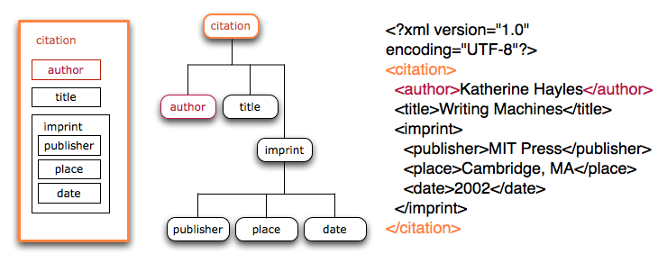

# XML as model and expression

## Three views of XML

As set out in the [Data model section](https://github.com/Pittsburgh-NEH-Institute/Institute-Materials-2017/blob/master/schedule/week_2/model_syntax_semantics.md), XML is defined by its syntax ([Extensible Markup Language (XML). 1.0 (Fifth Edition).
W3C Recommendation 26 November 2008](https://www.w3.org/TR/xml/)), but the syntax represents a serialization of a tree, which is a data model.

[Image from <http://www.wwp.neu.edu/outreach/seminars/_current/presentations/xml_intro/xml_newIntro_tutorial_02.xhtml>]

## Markup and semantics

When we talk about XML we usually mean the data model and syntax together. XML prescribes no element or attribute names (except for attributes bound to the XML namespace with the `xml:` namespace prefix) and therefore no formalized semantics. The meaning of elements and attributes is imposed by the developer or markup language designer, and semantically motivated constraints may optionally be formalized in a schema.

See [Toward a semantic for XML Markup](10.1145/585058.585081)(2003) for a brief but insightful presentation of the role of semantics in markup.

For example, a paragraph could be tagged with the `<para>` element, but just as well with the `
` element. An XML doesn't know the meaning of either of these elements, this is defined in a schema (in this case of DocBook and TEI respectively):

### Paragraphs in DocBook and in TEI

#### The DocBook `<para>` element

> A `Para` is a paragraph. 

#### The TEI `
` element

> `
` (paragraph) marks paragraphs in prose.

### Quotation in the TEI

The same holds for a citation, which may be tagged with a `<q>` tag or with a `<quote>` tag.

#### The `<q>` element

> `<q>` (quoted) contains material which is distinguished from the surrounding text using quotation marks or a similar method, for any one of a variety of reasons including, but not limited to: direct speech or thought, technical terms or jargon, authorial distance, quotations from elsewhere, and passages that are mentioned but not used.

#### The `<quote>` element

> `<quote>` (quotation) contains a phrase or passage attributed by the narrator or author to some agency external to the text.
 
#### The `<soCalled>` element

> `<soCalled>` contains a word or phrase for which the author or narrator indicates a disclaiming of responsibility, for example by the use of scare quotes or italics.

### Descriptive and presentational markup in HTML5

#### The `<i>` element

> The `i` element represents a span of text in an alternate voice or mood, or otherwise offset from the normal prose in a manner indicating a different quality of text, such as a taxonomic designation, a technical term, an idiomatic phrase from another language, transliteration, a thought, or a ship name in Western texts.  
[...]  
Authors are encouraged to consider whether other elements might be more applicable than the `i` element, for instance the `em` element for marking up stress emphasis, or the `dfn` element to mark up the defining instance of a term.  
[...]  
Style sheets can be used to format `i` elements, just like any other element can be restyled. Thus, it is not the case that content in `i` elements will necessarily be italicized.

#### The `<em>` element

> The `em` element represents stress emphasis of its contents.

#### The `<dfn>` element

> The `dfn` element represents the defining instance of a term. 

#### The `<cite>` element

> The `cite` element represents a reference to a creative work. It must include the title of the work or the name of the author(person, people or organization) or an URL reference, which may be in an abbreviated form as per the conventions used for the addition of citation metadata.

## Sources

* [DocBook: The definitive guide](http://tdg.docbook.org/tdg/5.2/para.html)
* [HTML5. A vocabulary and associated APIs for HTML and XHTML. 
W3C Recommendation 28 October 2014](https://www.w3.org/TR/html5/)
* [TEI P5: Guidelines for Electronic Text Encoding and Interchange](http://www.tei-c.org/release/doc/tei-p5-doc/en/html/index.html)