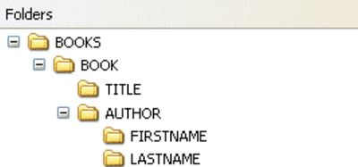

# XPath navigation

## Why XPath?

XPath is a technology for traversing an XML document to perform tasks like “find all speeches by Hamlet” or “find all chapters that contain only one paragraph”. Developers use XPath to explore their XML and as a means to interact with it, but XPath is also important as an *ancillary* technology used by XSLT (to transform XML), XQuery (to … er … query XML), and Schematron (to validate XML against constraint rules). Everything interesting that we can do with XML starts from XPath!

We’ll use XPath in our Institute to examine what it means to interact with documents that have been modeled as ordered trees. It turns out that some traversals are easier than others, not only because of the distance and route, but also because XPath deals more idiomatically with some types of traversal than others.

As you will learn, XPath depends on XML's tree structure. Working with XPath, then, is a good way to understand how your XML file is structured and to get a better grip at the relationship between the different nodes in the XML tree. The syntax of XPath is similar to file paths, because the file system is also a tree:



Still, you can also traverse your document using XPath in ways that completely ignore the tree structure, for example ```*distinct-values*(//speaker)``` returns all the values of the ```speaker``` elements in the document.

## XPath components

### Overview

XPath consists of three principal types of components:

* **Path expressions** are used to navigate and traverse the tree. For example, we can use a path expression to navigate to all speeches in a play.
* **Functions** take input (typically from the tree) and produce output. For example, we can use an XPath function to take each speech in an XML document (a single string of text) and separate it into words by dividing on white space or punctuation.
* **Predicates** filter XPath expressions. For example, we can use an XPath expression to find all speeches in a play and then use a predicate to return only those spoken by Hamlet, or only those spoken by Hamlet that contain more than 100 words.

### Path expressions: walking the tree

Open `hamlet.xml` in your XML editor of choice. Note that the Institute uses \<oXygen/\> XML Editor and the following instructions may differ if you use a different editor. 

You find the file `hamlet.xml` in schedule/week_2 in your local copy of the Institute repo. In the upper left of your \<oXygen/\> editor, configure the XPath browser box to use XPath 3.0. You’ll type XPath expressions into the browser box and hit `Return` to navigate within the document.

This document is a TEI-encoded edition of a play. To navigate within an XML document you need to know how it has been marked up. If it’s marked up according to the TEI guidelines, you can rely on what you know about TEI. If not, skim through the document in \<oXygen/\> to explore how it tags different components.

Path basics:

* Paths are made up of path steps. Each one starts from the current location; where you end up becomes the new “current location” for the next step.
* A slash within a path means “start from the immediately preceding path step”. If it specifies an [axis](https://www.w3.org/TR/xpath-3/#axes), use that; otherwise the child axis is the default.
* A double slash within a path means “look at the descendants of the immediately preceding path step”. It is also possible to navigate upward (to parents and higher ancestors), leftward (to preceding siblings or all preceding nodes), and rightward (to following siblings or all following nodes).
* A slash (single or double) at the beginning of an XPath expression means “start at the document node”.
* Because trees are fully connected, from any location in the tree there is at least one path to any other location or set of locations.

Sample paths:

* `/TEI/text/body/div` finds all acts. A path expression that begins with a slash starts at the document root node, which is at the top of the document tree. Each subsequent slash navigates from the preceding one (by default to its children, unless a different axis is specified).
* `//body/div` finds all acts. A double slash means “look at my descendants”. A path that begins with a double slash means “start at the document node and look at the descendants”, that is, look at everything.

## XPath functions

* `//body/div/count(descendant::sp)`. This counts the speeches in each act. The last path step is a function, it counts the descendants of the preceding path step, that is, of each act.

## Filtering with predicates

* `//body/div[2]` finds Act 2. This is a *numerical predicate*. It finds all acts and then filters them to keep only the second in the sequence.

* `//body/div[descendant::speaker = 'Ophelia']`. This finds all acts and filters them to keep only the ones that have a descendant `<speaker>` element of “Ophelia”, that is, all acts in which Ophelia speaks.

* Find all of the stage directions that are inside a metrical line (<l>), that is, between the starting <l> and the ending </l>:
```//l/stage[ancestor::l]```   

* Enjambement: a line beginning inside a phrase can be found with the XPath ```//phr[lb]``` or ```//lb[parent://phr]```. These are good examples of predicates.

## Your turn

Here are some XPath expressions you can use for practice (they get progressively more complex or advanced)—or you can invent your own!

* *Hamlet*, like a typical Shakespearean tragedy, contains five acts, each of which contains scenes. Both acts and scenes are encoded as division (`<div>`) elements. How can XPath tell them apart? What XPath would find just the acts? What XPath would find just the scenes? What XPath would find just the scenes in Act III?
* Stage directions (`<stage>`) occur in a variety of contexts.
What XPath would find all of the stage directions that are inside a metrical line (`<l>`), that is, between the starting `<l>` and the ending `</l>`. Hint: They may not be immediate children of `<l>` elements. How many are there?
* What XPath would find all of the stage directions that are directly inside a speech (`<sp>`), that is, inside a speech but not inside a line within a speech?
* What XPath would find all of the stage directions that are *not* directly inside a speech or a line. How many are there? Hint: You’ll need the [`not()`](http://www.xsltfunctions.com/xsl/fn_not.html) function for this. What XPath expression would return the *parent* elements of the stage direction you just found?
* How many scenes are there in each act? Hint: Acts are `<div>` children of `<body>` and scenes are `<div>` children of acts. The answer for the five acts, in order, is is 5, 2, 4, 7, 2.
* In which scenes does Hamlet speak? Hint: If Hamlet speaks in a scene, that scene has a descendant `<speaker>` element equal to the string 'Hamlet'. The answer is that Hamlet speaks in Act 1, Scene 2; Act 1, Scene 4; Act 1, Scene 5; Act 2, Scene 2; Act 3, Scene 1; Act 3, Scene 2; Act 3, Scene 3; Act 3, Scene 4; Act 4, Scene 2; Act 4, Scene 3; Act 4, Scene 4; Act 5, Scene 1; and Act 5, Scene 2.
* What XPath expressions will find the last stage direction (`<stage>`) in the entire document? Hint: there should be only one!
* What XPath expression will find all speeches (`<sp>` elements) with more than 8 line (`<l>`) subelements? Hint: you’ll need to use the [`count()`](http://www.xsltfunctions.com/xsl/fn_count.html) function.
* Building on your answer to the preceding question, what XPath expression will tell you how many line (`<l>`) subelements each of those speeches actually has?
* Building on your answers to the preceding two questions, what XPath expression will find the speakers of all speeches that have more than 8 line subelements? Once you’ve found the speeches that have more than 8 lines, you can find the speakers of those speeches by just adding another path step, but you’ll get some duplication, since a single person may have more than one long speech. Your answer to this question should get rid of the duplicates, and return just a list of names of speakers without duplication. Hint: You’ll need to use the [`distinct-values()`](http://www.xsltfunctions.com/xsl/fn_distinct-values.html) function.
* What are the XPaths to find speeches (`<sp>` elements) with more than 8 line (`<l>`) *child* elements and speeches with more than 8 *descendant* line elements? How do those results differ? If there are descendant line elements that are not children of a speech, what is their parent? If you don’t know the types of their parent elements in advance, what XPath expression will tell you?
* What are the speeches (`<sp>` elements) that mention Ophielia by name? Hint: you’ll need to use the [`contains()`](http://www.xsltfunctions.com/xsl/fn_contains.html) function. Who are the distinct speakers of those speeches? How many distinct speakers are there?
* What is the longest speech in the play? Hint: You’ll need to use the [`string-length()`](http://www.xsltfunctions.com/xsl/fn_string-length.html) function.
* Just measuring speech length in the task above includes a bunch of spaces and newlines that are just padding. What’s the longest line after you get rid of distracting whitespace with the [`normalize-space()`](http://www.xsltfunctions.com/xsl/fn_normalize-space.html) function?
* Given the preceding solution, how can you use that XPath expression to retrieve the longest `<sp>` itself? No fair checking the length and then writing a separate XPath that looks for that number. Your answer must find the longest speech without your knowing how long it is.

## Further reading

* [What can XPath do for me?](http://dh.obdurodon.org/introduction-xpath.xhtml)
* [XPath and XQuery Functions and Operators 3.1
W3C Recommendation 21 March 2017](https://www.w3.org/TR/xpath-functions-31/)
