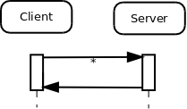
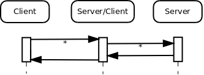
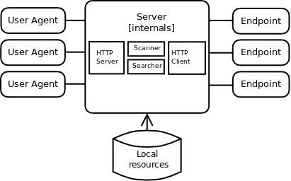
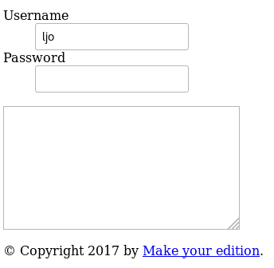

# Using APIs in your edition
Explore ways of using APIs in your edition. At the end of the session, we’ll ask you you to show your API to your fellow participants.

## Verbs and parameters
These are the HTTP methods that are also called _verbs_. Do you remember the ones we used from previous sessions?

## APIs are for interaction
Tight coupling inhibits use and reuse, so aim for loose coupling. If we start with the overview we already visited: 

And you are using external resources:

Your Server is not a black box, so why not open it up:

Your details, of course, will vary.

These overviews and interaction diagrams offer you, as well as your partners, consultants, and users, information, quick overviews,  and something to point at when discussing your architechure.

### RESTful or REST-like
RESTful or REST-like APIs are more about _nouns_ than _verbs_. If you were to navigate to the following hypothetical URI:

<http://localhost:5000/resource/form_1/value/ljo>

you might see, in response:

More on this later.

## What makes it work or not?
Evaluate the pros and cons of investing resources in publishing an API. If you decide that publishing an API is worth the investment, it requires substantial resources and complete transparency to come up with and communicate, e.g., visions, use cases, and metrics to potential users (also remember *_dog fooding_*, that is, the fact that you are likely to be a consumer of your own product). 

* Documentation
  - Visions and values
  - Use cases
  - Metrics
  - Examples of use
* Building trust
  - Show you are serious
  - Don’t waste their time
  - Show that it is mutual
  - Have your licenses ready
* Versioning
  - The First version is crucial; it will be there for a long time
  - Be careful with changes
  - Be aware of the cost of new versions
  - Prioritize developer experience

## API creation process
An API needs to be a first class citizen of your universe. You need to cover all of the following aspects to make it successful: 

* Values (think elevator pitch)
* Metrics
* Use cases
* API design and schema model

### Metrics
Metrics need to be non-internal.

* How many users?
* How many times a day does an average user visit?
* Number of integrations in partner systems?

Partner integrations may be good sources of use cases. 

* What information is needed?
* Do we provide what is needed?

### Design your API
Modularize your APIs, e.g.:

* Selection APIs
* Reporting API
* Search API
* Navigation APIs
* Sharing API
* Administration API
* etc.

**Be consistent**. Make sure to be in overview mode often enough. Modeling schemas will take time (total hours) and times (don’t do it all at once; pause, review, and return). 

See it as _one cohesive system_ with _items_, rather than constructing each API module independently of the others. A _resource_ should be the same in all API modules. 

Don’t forget do make a human-readable documentation for each endpoint:

* Methods
* Fields
* Formatting in response
* Metadata

OpenAPI could help you with schema modeling and documentation (there are other options but they often change names. e.g., Apiary, Blueprint). _RAML_ is a schema modeling language. You could look at [API commons](http://apicommons.org/) and get inspired for some parts of your APIs.

*Exercise:* Think about the most important _nouns_ in your use cases. Write them down on sticky notes and connect them with yarn to features and use cases previously put on the board.

