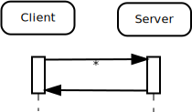
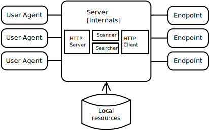

# Using APIs in your edition
Explore several aspects of using APIs in your edition. By the end of the session you will show the API for you fellow participants.

## Verbs and parameters
These are the HTTP methods that are also called verbs. Do you remember the ones we used from previous sessions?

### RESTful or REST-like
RESTful or REST-like APIs are more about nouns than verbs.

<http://localhost:5000/resource/form1/value/ljo>

More on this later.

## What makes it work or not?
Considered the pros and cons of putting resources into publish an API or not.
If the answer is yes to publish the APIs it requires substantial resources and complete transparency to come up with and communicate, e.g. visions, use cases, metrics to potential users (also remember *_dog fooding_*). 
* Documentation
 - visions and values
 - use cases
 - metrics
 - examples of how to use
* Building trust
 - show you are serious
 - don't waste their time
 - show it is mutual
 - have your licenses ready
* Versioning
 - first version is crucial, it will be there for a long time
 - be careful with changes
 - be aware of the cost of new versions
 - Prioritize developer experience

## API creation process
A API needs to be a first class citizen of your universe. You need to cover all there aspects to make it successful: 

* Values (think elevator pitch)
* Metrics
* Use cases
* API design and create schema model

Do not skip any of them.

### Metrics
Metrics need to be non-internal.

* How many users
* How many times a day do an average user use it
* Integrations in "partner" systems

Partner integrations are often great for collecting use cases too. 

* What information is needed?
* Do we provide what is needed?

### Design your API
Modularize your APIs, e.g.:

* Selection APIs
* Reporting API
* Search API
* Navigation APIs
* Sharing API
* Administration API
* ...

Be consistent. Make sure to be in overview mode.

Modeling schemas will take time. Get back to it several times. See it as a cohesive system with items rather than each API module have items on its own. I.e. a _resource_ should be the same in all API modules. 
Don't forget do make a human-readable documentation for each endpoint:

* Methods
* Fields
* Formatting in response
* Any metadata

OpenAPI could help you with schema modeling and documentation (there are other options but they often change names. E.g. Apiary, Blueprint). _RAML_ is a schema modeling language. You could look at [API commons](http://apicommons.org/) and get inspired for some parts of your APIs.

 
